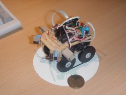

The first robot I build, with the following characteristics:

- slow
- power hungry
- expensive
- useless sensors
- a lot of fun to build and program

The actuators of this vehicle are two small hobby servos, patched for continuous rotation. It uses a tracked driving mechanism, like a tank, in which a third drive wheel and a driving belt makes the wheels turn. It uses two Ir proximity detectors (SFH900, Siemens), two Ir ambient light detectors(Ir Photo LED) and two pairs of whiskers as the main sensory equipment (Guitar string).

Power is drawn from two NiMH 3.6V CMOS batteries and guarantees at least 10 minutes of continuous operation. It has a piezo speaker for making squeaking noises and even has a plug for charging the batteries ... Oh, before I forget, it's brains are a Atmel AVR 2313 running at 4Mhz and the motors are driven by a L293D H-bridge.

» That's all!
