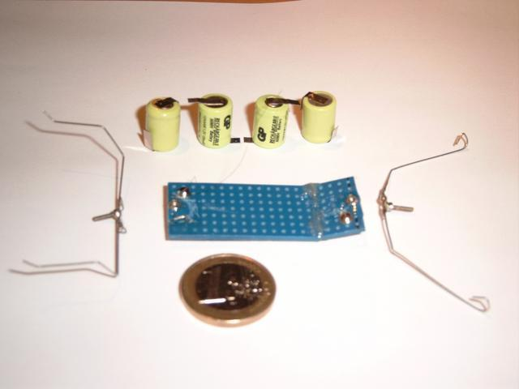
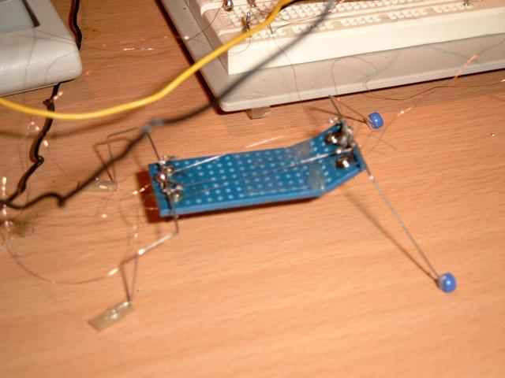
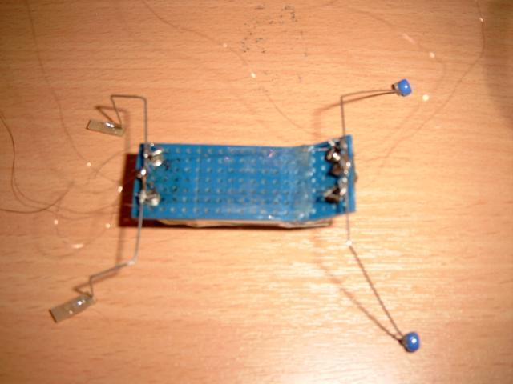
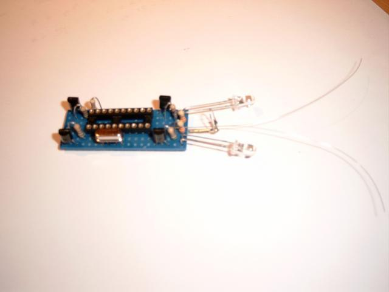

This walking robot is powered by SMA (Shape Memory Alloy) actuators. SMA is also called nitinol, flexinol or muscle wire. Although I knew muscle wire existed for some time, I did not experiment with it because of its high power requirements that are almost not reachable in sub 10 cm robots. After reading about the usage of muscle wire in an artificial lobster ([Neurotechnology for Biomimetic Robots](http://www.neurotechnology.neu.edu/neurotechnology.html)) I got interested again in the subject.

## A few more images

