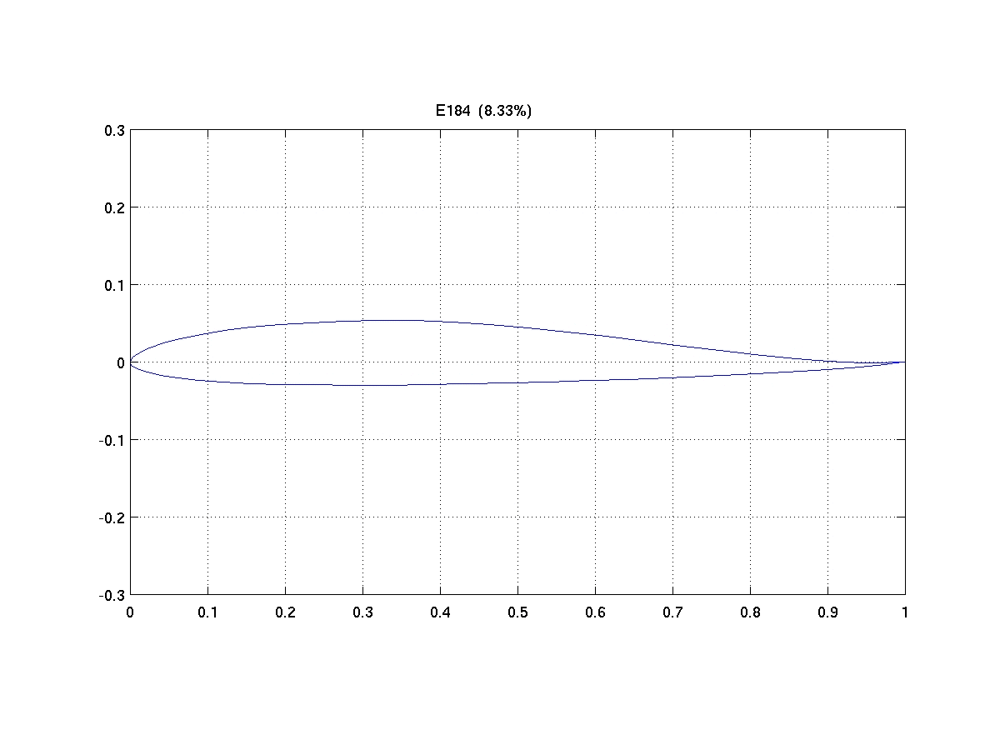
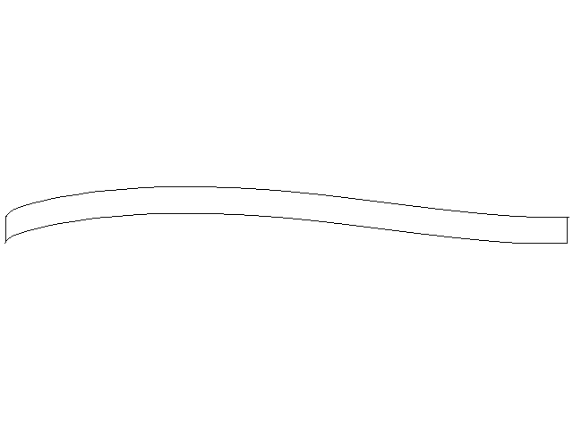
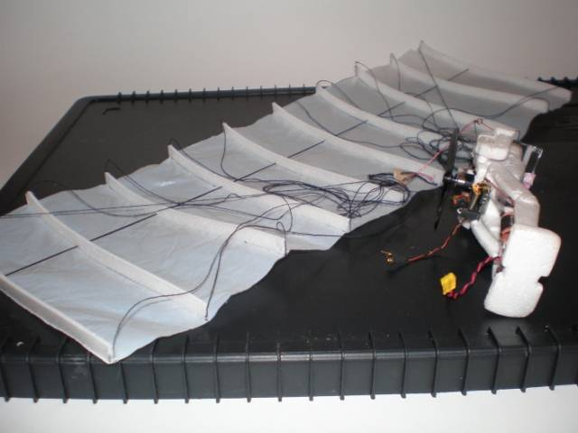
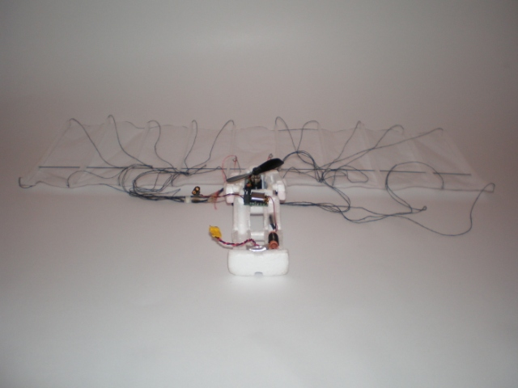
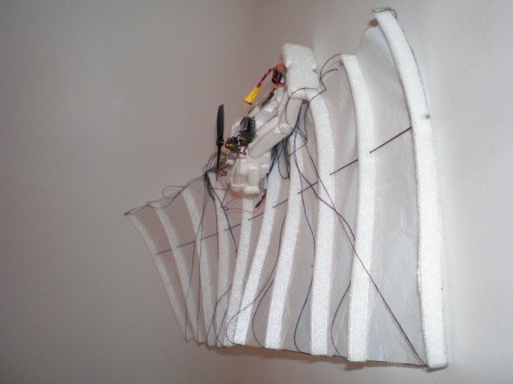
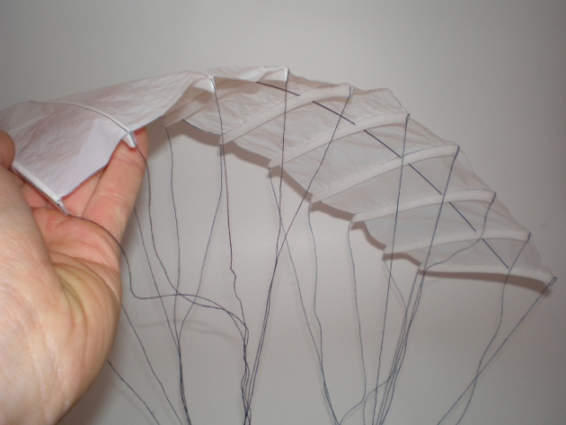
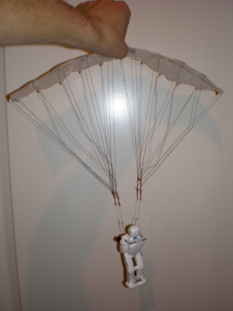
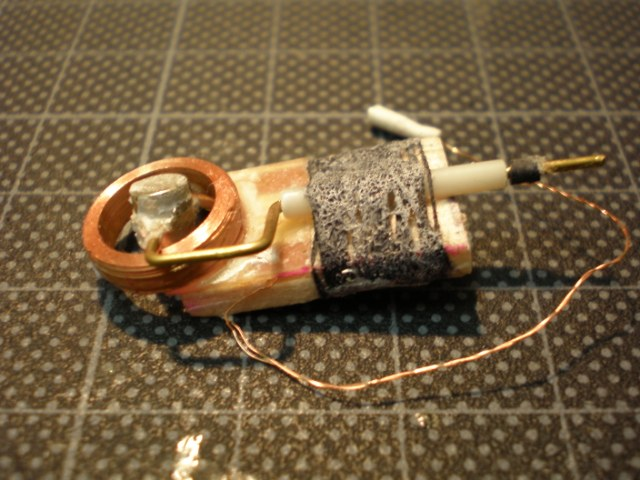

Inspired by some local guys who fly paramotors on quiet evenings I decided to build myself an indoor paramotor. After some research I came up with a rather simple design for a motor powered paraglider which has a sail of 36cm span and a chord of 12cm. For the carriage I went for a recycled robocopter guy - this is a helicopter toy that has a robot like body instead of a conventional helicopter fuselage. After some surgery like letting a stake protrude from its chest he seems happy after all beneath the small sail. A light weight grocery bag is used for the sail, which is semi self supporting because of  depron ribs and a carbon rod spar.

### Demo movie

[This small movie](https://vimeo.com/516676345) was filmed at our local indoor rc group gathering and filmed with my Nokia 5500 GSM, so do not expect any fancy stuff. However, you see the parasail flying along. Although it steers rather easily, you need to be carefull not to end up in a death spiral. Too much deflection of your stick and the paraglider goes down. For me this proves that paragliding is a risky business!

### The sail

The sail is made from a light-weight grocery bag and measures 36cm by 12cm. The ribs are made from 2mm depron and have a reflexed airfoil. The airfoil used here is the upper part of the Eppler 184. A total of 10 ribs are placed at 4cm intervals, giving a total span of 36 cm. The reflexed airfoil is choosen for extra longitudenal stability. However, you can argue it is still needed given the very low center of gravity.

The sail is made semi self supporting. It uses ribs to provide the airfoil and a small carbon rod makes sure it does not collapse. At this scale, it will be very hard to make a sail that can sustain its form only by the air captured in pockets.

The lines are made from knitting yarn. The front lines are approximately 40cm long and the aft ones 43 cm. The angle of attack is approximately set at around 7 to 10 degrees. I should measure it more exactly, but it should be around that number. The angle of attack is rather large, but I had to set it like that because otherwise the paraglider stalls instead of climbs.

### Controls

Turning is done by shifting the weight of the puppet. First I tried the biggest actuator I had in my box-o-actuators, but that did not do the job. It was just not powerfull enough and the loose coupling of an actuator was not good for roll/yaw stability. Anyhow, I put in a lightened crystal blue servo of approximately 4 grams - only 2 grams heavier then the actuator - and that just works fine.

When you increase the power, the paramotor climbs, when you decrease power it will sink. When you apply no power, it will go down rather quickly. The reason for this is that the angle of attack is fixed and set at a high negative angle. Full size paramotors have break lines. They can pull down the rear tips of the sail, thus decreasing the angle of attack.

### Motor and prop combination

The powerplant is a motor/prop combination from a salvaged X-Twin plane. They give enough power and only pulls around 500mAh, which is just within the limits what the 50mAh LiPo can give. Flight time with this combination is maximum 5 minutes.

### Receiver

The receiver is a MicronInvent minor - one of the best indoor rc receivers around for conventional RF.This is a 35MHz FM receiver, weighs only 2 grams with crystal. Has 5 servo channels or 2 actuator channels and a built-in speed controller.

### Full specs

  * Weight: 13 grams
  * LiPo: 50MAh
  * Receiver: Minor RX
  * Wingspan: 36 cm
  * Chord: 12cm
  * Line length: approx. 40cm
  * Pilot: recycled robocopter pilot
  * Motor: X-Twin prop: X-Twin

### Some images

### Further reading

- [Another indoor paramotor I discovered](http://www.rcgroups.com/forums/showthread.php?t=763749 "Another indoor paramotor")
- [MicroInvent RX](http://www.microinvent.com/mambo/index.php)
