Recently I bought a bicycle trailer (remork) to transport my kids to school. As school is only 2 kilometers away and there is always a long queue of cars waiting for the traffic lights, using a bike is actually faster then taking a car. This renewed my interest in biking and off course is a good thing for my health! After installing a cheap bike computer, I had some feedback on my daily performances. It is quite fun to try to keep your speed at around 20 km/h when pulling an extra mass of approximately 40 kg. What I missed, though, was some historic feedback. The bike computer provided me with actual speed, average and top speed, but I was more interested in getting a graph. Plotting the speed versus distance traveled was my ultimate goal.

Because I had an old Palm III laying around catching some dust, I thought a bit of googling around Palm and bike computer would not hurt. That is when I discovered Veloace ([http://www.engbedded.com/veloace](http://www.engbedded.com/veloace)). VeloAce is an Open Source bike computer for PalmOS devices with some very advanced features, like logging distance versus speed, acceleration, trip time and a lot more.

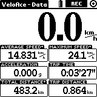

There are different types of cables available to interface an odometer sensor to the Palm. Basically all the sensors use just a reed-switch ([http://en.wikipedia.org/wiki/Reed\_switch](http://en.wikipedia.org/wiki/Reed_switch)) and a magnet fixed to a spoke in the front wheel. When the magnet passes the switch, it will close and thus give contact. Veloace uses the RTS and RXD pins on the connector, both are part of the RS232 serial communication standard. So, the switch will short RTS and RXD, giving a pulse, when the wheel rotates one full turn, to the software.

As a prototype to mount my PalmIII to my bike, I just connected a PalmIII serial cable to the PalmIII and made a small SUBD9 connector onto which I soldered the correct pins to the wires of the sensor. The Palm III got fixed to the steer by some rubber bands. Although it all worked, this was sub-optimal, too bulky and clumsy and the connector on the PalmIII kept getting loose on jumpy roads. I needed a better solution.

A solution like the original bike computer would be ideal. It is a small device that slides into a fixture on the steer of your bike. If only I could reuse that fixture for my Palm III. Well, that is just what I did.  I took the bike computer apart, which luckily was very cheap at around 3 euros. The lower part of the shell contained the physical connector to the fixture. It has two metal contacts that connect to the wires of the sensor when you slide it into the fixture. I hot-glued this lower shell to the back side of my Palm III.

But before glueing the lower shell I soldered some wires straight on the Palm III interface board and brought them outside via a small hole that gets covered by the lower shell.

Now I can easily insert and remove my Palm III bike computer and just use it as regular bike computer. I hope that the photos below give you enough detail to do it yourself. Happy biking to all!

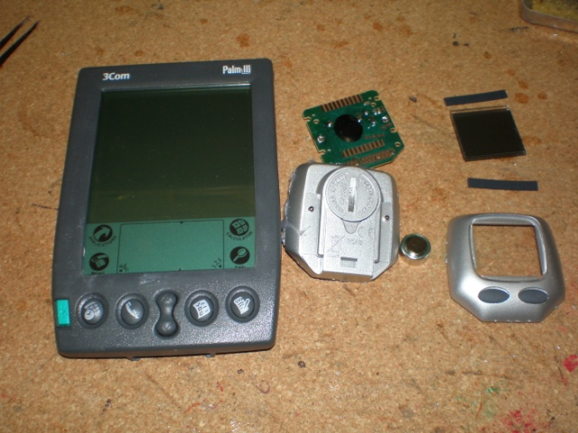

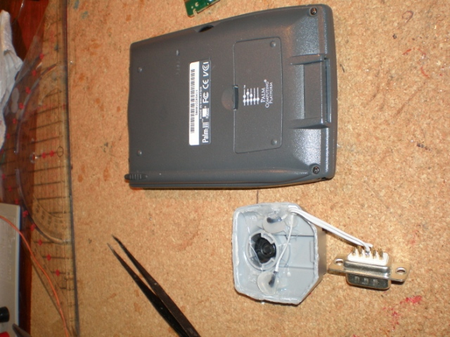

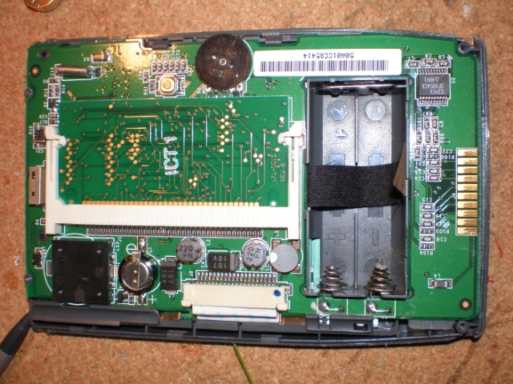

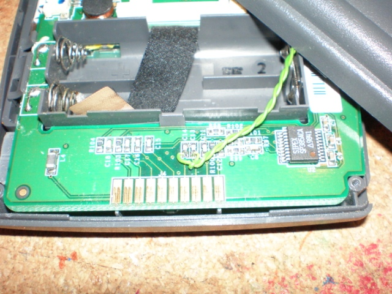

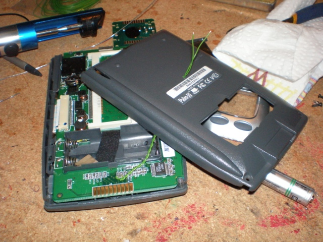

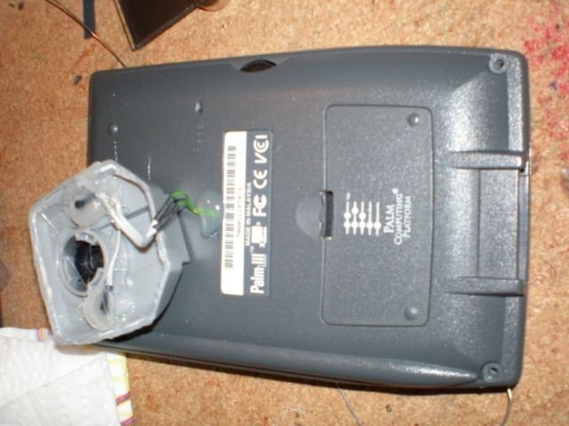

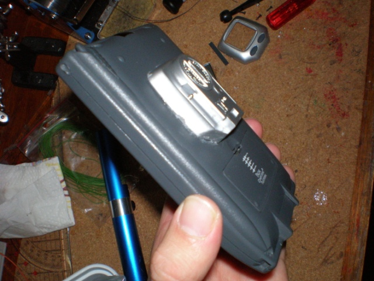

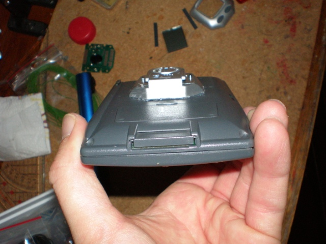

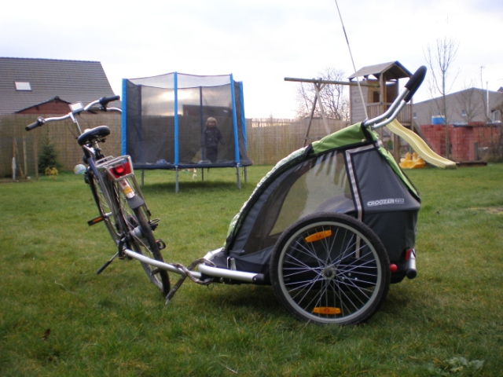

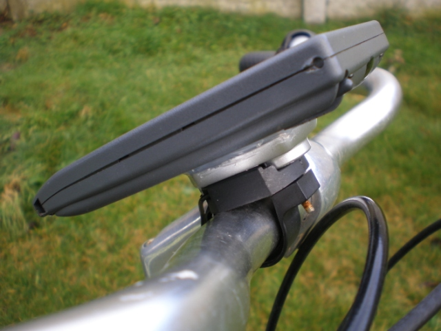
