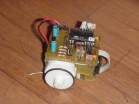

This robot is build using small stepper motors that are actually used within the dashboard of VolksWagen cars. I bought them at [http://www.didel.com](http://www.didel.com/), where you can find a lot of other interesting robot stuff. They don't generate a lot of torque, but seem to be sufficient to drive a small autonomius vehicle. An other plus is the low power consumption, a simple 9V battery can drive the system for more then a full day.

» That's all!
