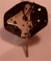
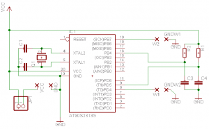
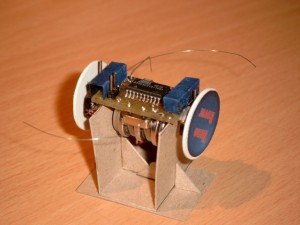

This is one of the most unconventional designs I've build up to date. It does not run straight, but crawls. The reason for this is that both motors are unidirectional. It uses two wristwatch lavet-type motors as it main actuators and uses two whiskers and two directional LDR light sensors for sensing it's environment. The biggest problem with robot is the fragile connection of the wheels to the shaft of the engine.

## Introduction

The Nano Rover is an autonomous vehicle that uses two wristwatch motors as its main actuators. Analog wristwatch motors are one-phase Lavet stepper motors and are driven by a biphase pulse for every step. Small actuators are hard to get, most micromotors are too big for very small scale - aka tabletop - robots and consume too much power. The wristwatch motors are a nice trade-off between cost and performance. The only drawback is that they can only turn clockwise. There are wristwatch motors that can turn in both directions, but these are very hard to find. The design of the robot is build around this limitation of clockwise turning. The movement pattern of this robot is worm-like, in which each motor runs after each other and let the robot crawl around.

## The schematic

The robot is build around an AT90L2313 in an SOIC formfactor. This allows for some miniaturization of the electronics.

## Driving the wrist watch motors

To drive these motors, we have to provide a bi-phase pulse train. The following two images show us the pulses that are generated by the onboard electronics of a wristwatch.

\* Phase 1: 

\* phase 2: 

The interval between each pulse is exactly 1 second, the unit of movement of the seconds handle of the watch. The next image shows a complete period of this pule train.

\* Pulse train:

It is very easy to connect the wristwatch motor to a microcontroller, you connect one pin of the MCU to each end of the coil. There can be some concerns on the inductance of the coil, as the inducted potential can possibly damage the MCU. In practice , however, this has not happended to me.

Driving the watchmotor is easy as the next BASCOM AVR program shows us ...

ma  alias PORTB.0
mb  alias PORTB.1

DDRB = &B00000011
DDRD = &B01000000

dim a as byte
dim b as byte

ma = 0
mb = 0

a = 0
b = 1

MAIN:
ma = a
mb = b
waitms 3
ma = 0
mb = 0

toggle a
toggle b

waitms 1
goto MAIN

This will generate a pulse of 3ms, with a pause interval of 1 ms. the polarity of the pulse is inverted every time. The output period is 4 ms, resulting in a frequency of 1/0.004 = 250Hz. The second hand of the watch takes 60 pulses for one revolution. The speed of the second is thus 4.17 revolutions per second.

The revolutions speed of the minute hand is 60 times slower then the seconds hand. This means that the minutes hand is revolving at 4.17/60 = 0.0696 revolutions per seconds. Or 4.17 revolutions per minute.

The diameter of a wheel is 25 mm, the speed of the robot is thus 25xpix4.17 = 327.5 mm/minute.

A general formula for the revolutions per second of the seconds hand is:

n = 1/(60t)

Whereby:

\* n := revolutions per minute of the minute hand \* t := period of the pulse in seconds

The period of the pulse (t) can be split up in two part: t = ta + tp, whereby ta the time is that the pulse is active and tp is the pause time.

The time ta should always be between 3ms and 4 ms to have a steady going hand. Off course, other brands of wristwatch motors can vary this empirically defined optimum.

## The control program

The next control program allows the robot to crawl along, reacting to touch whenever one of the whiskers hits an object. This simple behavior allows the robot to crawl along obstacles. Although the light value is measured, by counting the time it takes to charge a capacitor through the light dependend resistor, nothing is done with this information. The next step is to add a few lines of code that will seek out dark - or bright - places.

'(
NanoRover
---------

Watch motor driven autonomous vehicle

- motion detection
- touch reaction -> inverse engines! (very easy)
- photofoob

touch is low level behaviour
compare two light sources, go to darkest place (e.g. n crawls)
then measure again and repaet
if dark censor under certain value, stay foot and do motion detection
on motion detection -> start moving for n steps towards the lightests place
')

' -- interface declarations
motor1\_a    alias PORTB.0
motor1\_b    alias PORTB.1
motor2\_a    alias PORTB.2
motor2\_b    alias PORTB.3

whisker1    alias PIND.4
whisker2    alias PINB.7

ldr1\_pin    alias PINB.4
ldr1\_port   alias PORTB.4
ldr2\_pin    alias PIND.5
ldr2\_port   alias PORTD.5

DDRB  = &B00001111
PORTB = &B10000000   ' internal pull-up
DDRD  = &B00000000
PORTD = &B00010000   ' internal pull-up

' -- the next two bits define the polarity on lead a and b for the 2 motors
dim polarity as bit
dim motor1\_enabled as bit
dim motor2\_enabled as bit
dim pulse\_counter as word
dim state\_on\_tick as byte
dim ldr1\_cnt as word
dim ldr2\_cnt as word
dim crawls as byte

state\_on\_tick = 0
pulse\_counter = 0

'( -- calculate 180° turn

d = 24 mm
l = 40mm

1 rot = 60\*60 = 3600 pulses
1 rot ~ 3.1415\*24 =  75.4 mm

180° ~ 2\*pi\*r/2 mm = 3.1415\*40 =  126 mm

n rot = 126/75.4 = 1.67

pulses = n \* 3600 =  1.67 \* 3600 = 6012

So we need to provide 6012 pulses, take 6000 for one half crawl
(1 inchwormy movement ...)
')
const HALF\_CRAWL = 6000
const CRAWLS\_BETWEEN\_THINKING = 5

'( -- calculate timing for IRQ
clock f = 10MHz
interval 1 = 4 ms
interval 2 = 8 ms

ticks 1 = f\*t = 10000000 \* 0.004 =  40000
ticks 2 = 10000000 \* 0.008       =  80000

we need to do a time irq every 40k and 80k clock ticks

If we take the presacler at 1024, we need the next timer preload values

ticks 1 timer value = 1024 - 40000/1024 = 984.9375  ~ 985
ticks 2 timer value = 1024 - 80000/1024 = 945.875   ~ 946
')
const PULSE\_INTERVAL\_ACTIVE = 1024 - 40000/1024
const PULSE\_INTERVAL\_REST = 1024 - 80000/1024
config  TIMER0 = timer, PRESCALE=1024
on timer0 ON\_TICK
tcnt0 = 1023
enable timer0
enable interrupts

' -- initialize variables

' -- set up the interrupt handler to generate the drive puls for the 2 motors

' -- main subsumbtion loop

motor1\_enabled = 0
motor2\_enabled = 1
crawls = 0
MAIN:
' -- measure light
config ldr1\_pin = output
ldr1\_port = 0
waitus  100
config ldr1\_pin = input
ldr1\_cnt = 0
while ldr1\_pin = 0
incr ldr1\_cnt
waitus 50
wend

config ldr2\_pin = output
ldr2\_port = 0
waitus  100
config ldr2\_pin = input
ldr2\_cnt = 0
while ldr2\_pin = 0
incr ldr2\_cnt
waitus 50
wend
' print ldr1\_cnt; " "; ldr2\_cnt

' -- crawl
if pulse\_counter > HALF\_CRAWL then
toggle motor1\_enabled
toggle motor2\_enabled
pulse\_counter = 0
incr crawls
end if

' -- react to touch
debounce whisker1, 0, TOUCH
debounce whisker2, 0, TOUCH
goto NO\_TOUCH
TOUCH:
toggle motor1\_enabled
toggle motor2\_enabled
pulse\_counter = 0
NO\_TOUCH:

waitms 500
goto MAIN

ON\_TICK:
select case state\_on\_tick
case 0:
stop timer0
tcnt0 = PULSE\_INTERVAL\_ACTIVE

if motor1\_enabled = 1 then
motor1\_a = polarity
motor1\_b = not polarity
end if

if motor2\_enabled = 1 then
motor2\_a = polarity
motor2\_b = not polarity
end if

state\_on\_tick = 1

incr pulse\_counter

start timer0
case 1:
stop timer0
tcnt0 = PULSE\_INTERVAL\_REST
motor1\_a = 0
motor1\_b = 0
motor2\_a = 0
motor2\_b = 0
toggle polarity
state\_on\_tick = 0
start timer0
end select
return

## Images

Some extra photos of the robot in progress:

Some photos of the finished prototype:

