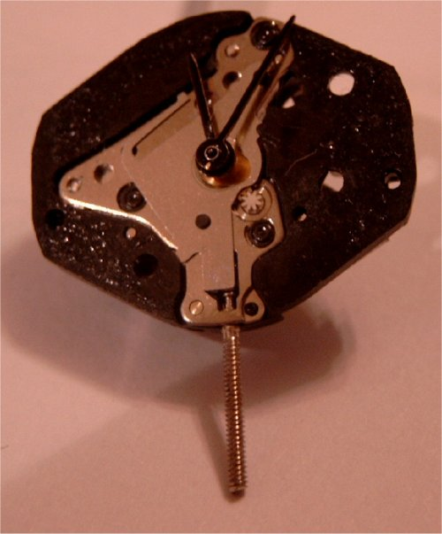
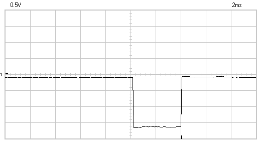
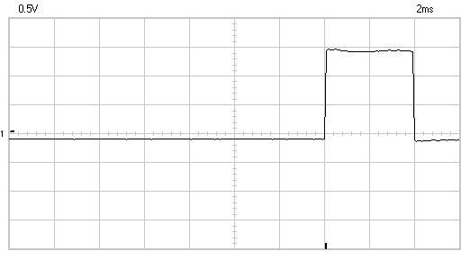
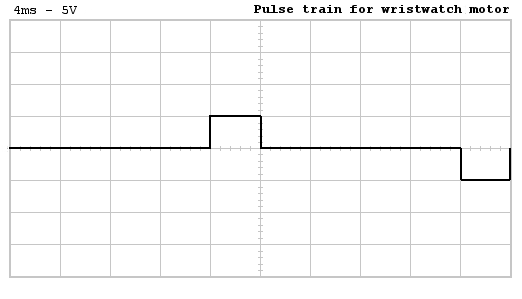
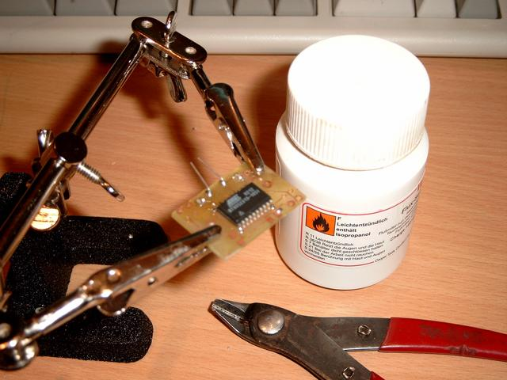
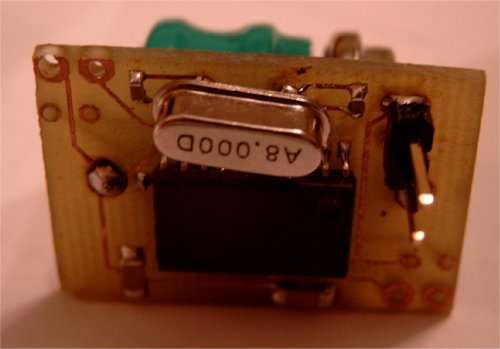
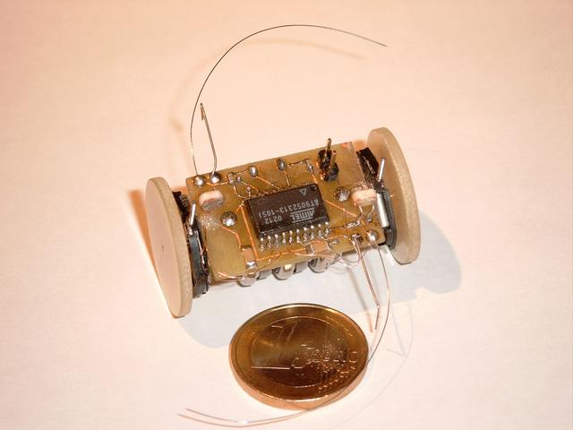
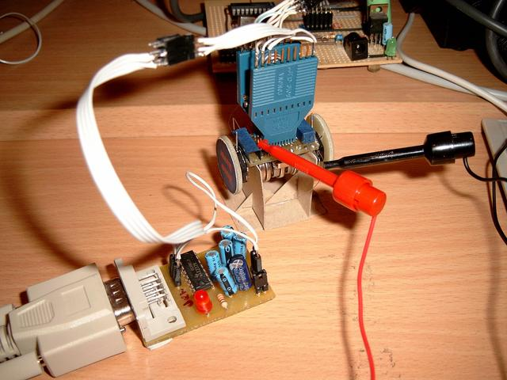

This is one of the most unconventional designs I've build up to date. It does not run straight, but crawls. The reason for this is that both motors are unidirectional. It uses two wristwatch lavet-type motors as it main actuators and uses two whiskers and two directional LDR light sensors for sensing it's environment. The biggest problem with robot is the fragile connection of the wheels to the shaft of the engine.

## Introduction

The Nano Rover is an autonomous vehicle that uses two wristwatch motors as its main actuators. Analog wristwatch motors are one-phase Lavet stepper motors and are driven by a biphase pulse for every step. Small actuators are hard to get, most micromotors are too big for very small scale - aka tabletop - robots and consume too much power. The wristwatch motors are a nice trade-off between cost and performance. The only drawback is that they can only turn clockwise. There are wristwatch motors that can turn in both directions, but these are very hard to find. The design of the robot is build around this limitation of clockwise turning. The movement pattern of this robot is worm-like, in which each motor runs after each other and let the robot crawl around.

## The schematic

The robot is build around an AT90L2313 in an SOIC formfactor. This allows for some miniaturization of the electronics.

{: dither="no" }

## Driving the wrist watch motors

To drive these motors, we have to provide a bi-phase pulse train. The following two images show us the pulses that are generated by the onboard electronics of a wristwatch.

### Phase 1:

{: dither="no" }

### Phase 2:

{: dither="no" }

The interval between each pulse is exactly 1 second, the unit of movement of the seconds handle of the watch. The next image shows a complete period of this pule train.

### Pulse train:

{: dither="no" }

It is very easy to connect the wristwatch motor to a microcontroller, you connect one pin of the MCU to each end of the coil. There can be some concerns on the inductance of the coil, as the inducted potential can possibly damage the MCU. In practice , however, this has not happended to me.

Driving the watchmotor is easy as the next BASCOM AVR program shows us ...

    :::basic
    ma  alias PORTB.0
    mb  alias PORTB.1
    
    DDRB = &B00000011
    DDRD = &B01000000
    
    dim a as byte
    dim b as byte
    
    ma = 0
    mb = 0
    
    a = 0
    b = 1
    
    MAIN:
    ma = a
    mb = b
    waitms 3
    ma = 0
    mb = 0
    
    toggle a
    toggle b
    
    waitms 1
    goto MAIN

This will generate a pulse of 3ms, with a pause interval of 1 ms. the polarity of the pulse is inverted every time. The output period is 4 ms, resulting in a frequency of 1/0.004 = 250Hz. The second hand of the watch takes 60 pulses for one revolution. The speed of the second is thus 4.17 revolutions per second.

The revolutions speed of the minute hand is 60 times slower then the seconds hand. This means that the minutes hand is revolving at 4.17/60 = 0.0696 revolutions per seconds. Or 4.17 revolutions per minute.

The diameter of a wheel is 25 mm, the speed of the robot is thus 25xpix4.17 = 327.5 mm/minute.

A general formula for the revolutions per second of the seconds hand is:

    n = 1/(60t)

Whereby:

  * `n` is revolutions per minute of the minute hand
  * `t` is period of the pulse in seconds

The period of the pulse (t) can be split up in two part: t = ta + tp, whereby ta the time is that the pulse is active and tp is the pause time.

The time ta should always be between 3ms and 4 ms to have a steady going hand. Off course, other brands of wristwatch motors can vary this empirically defined optimum.

## The control program

The next control program allows the robot to crawl along, reacting to touch whenever one of the whiskers hits an object. This simple behavior allows the robot to crawl along obstacles. Although the light value is measured, by counting the time it takes to charge a capacitor through the light dependend resistor, nothing is done with this information. The next step is to add a few lines of code that will seek out dark - or bright - places.

    :::basic
    '(
    NanoRover
    ---------
    
    Watch motor driven autonomous vehicle
    
      - motion detection
      - touch reaction -> inverse engines! (very easy)
      - photofoob
    
    touch is low level behaviour
    compare two light sources, go to darkest place (e.g. n crawls)
    then measure again and repaet
    if dark censor under certain value, stay foot and do motion detection
    on motion detection -> start moving for n steps towards the lightests place
    ')
    
    ' -- interface declarations
    motor1_a    alias PORTB.0
    motor1_b    alias PORTB.1
    motor2_a    alias PORTB.2
    motor2_b    alias PORTB.3
    
    whisker1    alias PIND.4
    whisker2    alias PINB.7
    
    ldr1_pin    alias PINB.4
    ldr1_port   alias PORTB.4
    ldr2_pin    alias PIND.5
    ldr2_port   alias PORTD.5
    
    DDRB  = &B00001111
    PORTB = &B10000000   ' internal pull-up
    DDRD  = &B00000000
    PORTD = &B00010000   ' internal pull-up
    
    ' -- the next two bits define the polarity on lead a and b for the 2 motors
    dim polarity as bit
    dim motor1_enabled as bit
    dim motor2_enabled as bit
    dim pulse_counter as word
    dim state_on_tick as byte
    dim ldr1_cnt as word
    dim ldr2_cnt as word
    dim crawls as byte
    
    state_on_tick = 0
    pulse_counter = 0
    
    '( -- calculate 180° turn
    
    d = 24 mm
    l = 40mm
    
    1 rot = 60*60 = 3600 pulses
    1 rot ~ 3.1415*24 =  75.4 mm
    
    180° ~ 2*pi*r/2 mm = 3.1415*40 =  126 mm
    
    n rot = 126/75.4 = 1.67
    
    pulses = n * 3600 =  1.67 * 3600 = 6012
    
    So we need to provide 6012 pulses, take 6000 for one half crawl
    (1 inchwormy movement ...)
    ')
    const HALF_CRAWL = 6000
    const CRAWLS_BETWEEN_THINKING = 5
    
    '( -- calculate timing for IRQ
    clock f = 10MHz
    interval 1 = 4 ms
    interval 2 = 8 ms
    
    ticks 1 = f*t = 10000000 * 0.004 =  40000
    ticks 2 = 10000000 * 0.008       =  80000
    
    we need to do a time irq every 40k and 80k clock ticks
    
    If we take the presacler at 1024, we need the next timer preload values
    
    ticks 1 timer value = 1024 - 40000/1024 = 984.9375  ~ 985
    ticks 2 timer value = 1024 - 80000/1024 = 945.875   ~ 946
    ')
    const PULSE_INTERVAL_ACTIVE = 1024 - 40000/1024
    const PULSE_INTERVAL_REST = 1024 - 80000/1024
    config  TIMER0 = timer, PRESCALE=1024
    on timer0 ON_TICK
    tcnt0 = 1023
    enable timer0
    enable interrupts
    
    ' -- initialize variables
    
    ' -- set up the interrupt handler to generate the drive puls for the 2 motors
    
    ' -- main subsumbtion loop
    
    motor1_enabled = 0
    motor2_enabled = 1
    crawls = 0
    MAIN:
    ' -- measure light
    config ldr1_pin = output
    ldr1_port = 0
    waitus  100
    config ldr1_pin = input
    ldr1_cnt = 0
    while ldr1_pin = 0
    incr ldr1_cnt
    waitus 50
    wend
    
    config ldr2_pin = output
    ldr2_port = 0
    waitus  100
    config ldr2_pin = input
    ldr2_cnt = 0
    while ldr2_pin = 0
    incr ldr2_cnt
    waitus 50
    wend
    ' print ldr1_cnt; " "; ldr2_cnt
    
    ' -- crawl
    if pulse_counter > HALF_CRAWL then
    toggle motor1_enabled
    toggle motor2_enabled
    pulse_counter = 0
    incr crawls
    end if
    
    ' -- react to touch
    debounce whisker1, 0, TOUCH
    debounce whisker2, 0, TOUCH
    goto NO_TOUCH
    TOUCH:
    toggle motor1_enabled
    toggle motor2_enabled
    pulse_counter = 0
    NO_TOUCH:
    
    waitms 500
    goto MAIN
    
    ON_TICK:
    select case state_on_tick
    case 0:
    stop timer0
    tcnt0 = PULSE_INTERVAL_ACTIVE
    
    if motor1_enabled = 1 then
    motor1_a = polarity
    motor1_b = not polarity
    end if
    
    if motor2_enabled = 1 then
    motor2_a = polarity
    motor2_b = not polarity
    end if
    
    state_on_tick = 1
    
    incr pulse_counter
    
    start timer0
    case 1:
    stop timer0
    tcnt0 = PULSE_INTERVAL_REST
    motor1_a = 0
    motor1_b = 0
    motor2_a = 0
    motor2_b = 0
    toggle polarity
    state_on_tick = 0
    start timer0
    end select
    return

## Images

