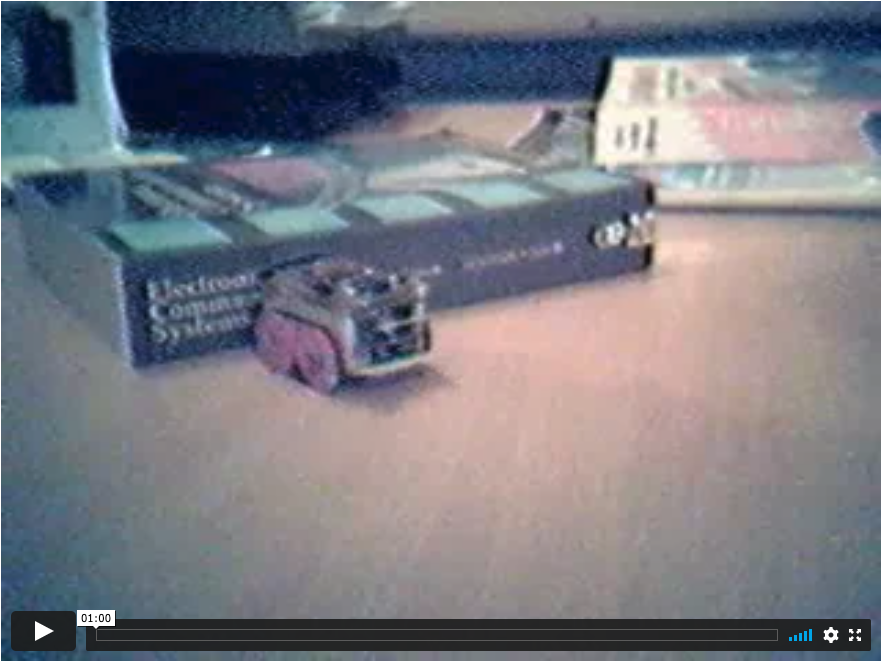
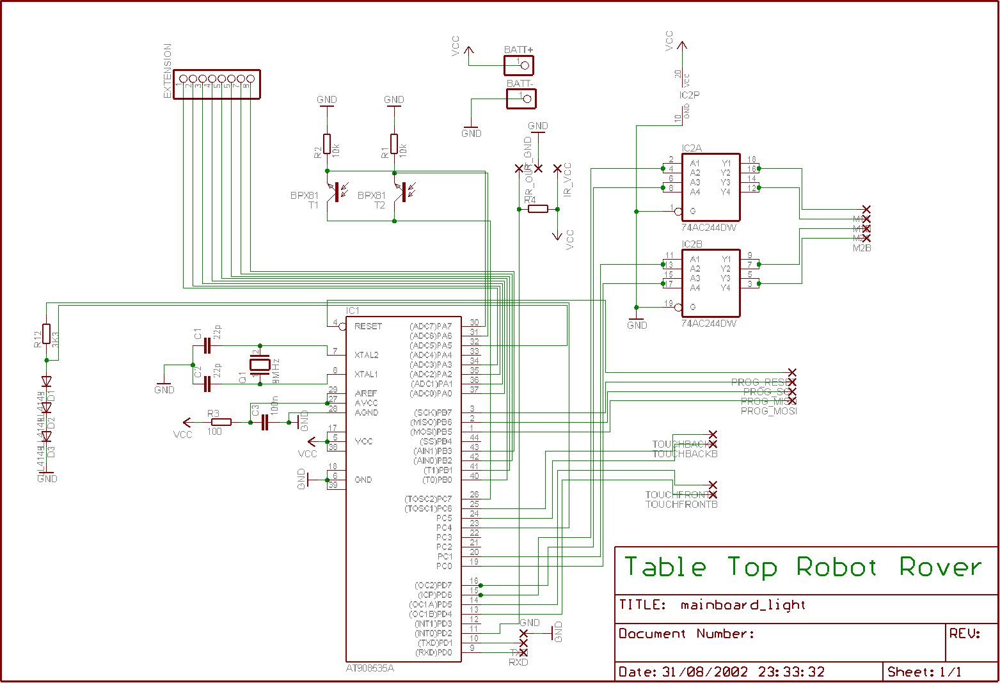
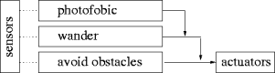
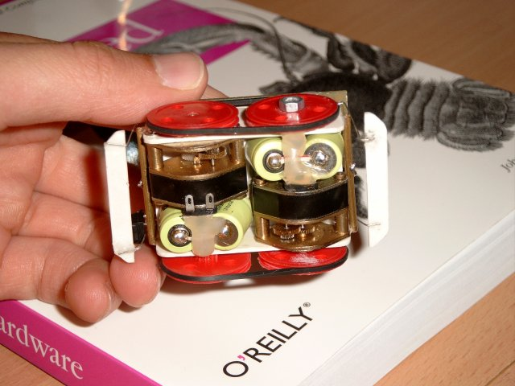
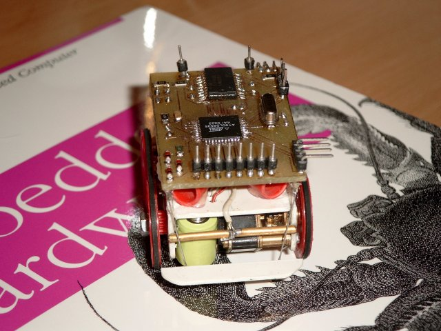
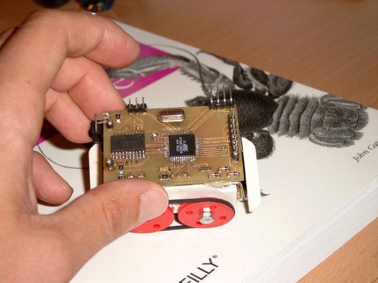
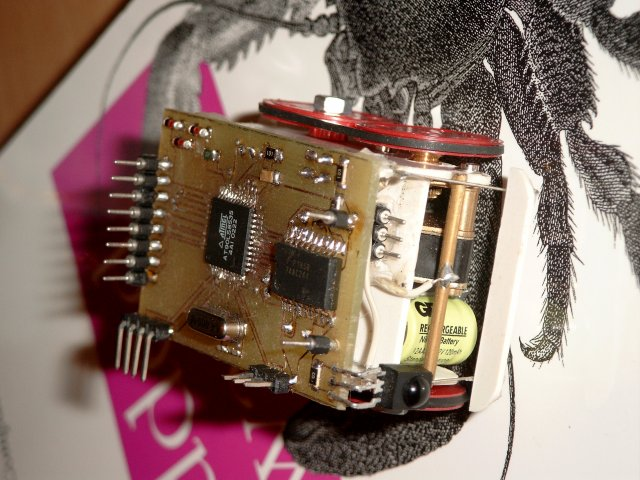

To date, this is my most successful design. It is powered by an Atmel 8535, which means you can write fairly complex applications (8Kb flash). It has 4 tactical sensors, two eyes based on LDR resistors placed in a tube to have directional sensory, one RC5 Ir diode to be able to command the robot using a standard remote control unit and expansion bus on the top of the vehicle (Wireless module has been build).

## Introduction

This small robot measures 75x38x50 mm, and is powered by two [geared DC motors](http://www.ftb-bertsch.de/zip_pdf/produkte/ftb0030.pdf). Four NiMH cells, delivering 120mAh at 1.2 V each provide enough power for approximately 1 hour autonomy. The brains of the robot are made up of a AT90LS8535 running at 4MHz in a TQFP package. The motors are driven by a 74AC244, an octal buffer/line driver which I used to make 2 H-bridges.

The robot has 8 sensors; 4 touch sensors on each corner, two directional LDR light sensors, one IR sensor (TSOP1736, RC5 type) and one proprioceptive sensor indicating battery status. This sensor package seems to be enough to provide for rather intelligent behavior.

The robot has a tank like locomotion. I've grown fond of this type of locomotion as it provides traction on all wheels. Also, I really enjoy the skid steering.

The robot has 4 connectors; one to charge the batteries, another one to program the robot, a serial connector and one expansion bus, exposing 8 data lines, from which 4 our ADC capable. I've build a wireless module to put on top of the robot. More on that will follow, sufficient to say now that it uses a BIM2 transceiver from radiometrix. I've experienced some troubles getting the PCB ready for the PC host adapter, as I had to redo the PCB for a few times to get it _right_. Hence, I put the wireless module on a lower priority.

[Link to a small video](https://vimeo.com/516676393)

## Schematic

{: dither="no" }

## Sample code

The next code is a small BASCOM program that can drive the MicroRover. It is a simple subsumption architecture, using 3 behaviors; photofobic, wandering and react to touch.

### Subsumption

{: dither="no" }

You can read more about the subsumption architecture in the following [wikipedia article about subsumption architecture](https://en.wikipedia.org/wiki/Subsumption_architecture).

### Code

    :::basic
    '(
    r o v e r
    ---------
    test code for rover based on 8535
    ')
    
    M1A alias portd.7
    M1B alias portd.6
    
    M2A alias portc.1
    M2B alias portc.0
    
    BAT_CONTROL alias portc.4
    const BAT_LEVEL = 5
    
    TOUCH_BACK_LEFT alias pinc.5
    TOUCH_BACK_RIGHT alias pinc.6
    TOUCH_FRONT_LEFT alias pind.4
    TOUCH_FRONT_RIGHT alias pind.5
    
    EYE_CONTROL alias portc.7
    const EYE_LEFT = 7
    const EYE_RIGHT = 6
    
    config Adc = Single , Prescaler = Auto
    config debounce = 10
    config Rc5 = pind.2
    enable interrupts
    
    ' -- subroutine declarations
    declare sub forward
    declare sub backward
    declare sub turn_left
    declare sub turn_right
    declare sub halt
    declare sub diagnostics
    
    declare sub motor
    
    declare sub touch
    declare sub photofoob
    declare sub wander
    
    ' -- variable declarations
    dim eye_l as  Word
    dim eye_r as  Word
    dim bat as Word
    dim tch_bl as bit
    dim tch_br as bit
    dim tch_fl as bit
    dim tch_fr as bit
    
    dim c as byte
    dim rc5_address as byte, rc5_command as byte
    dim temp as byte
    dim i as integer
    
    ' -- define behaviours
    
    '  . global settings
    const BEAT  = 50           ' -- unit of execution time
                             '  a behaviour will use this as a standard
                             '  time tick for action
    const BEAT2 = 100
    
    '  . touch
    dim touch_state as byte    ' - state of the 'touch' behaviour
    dim touch_dur as word      ' - duration
    dim touch_turn as byte
    dim touch_direction as byte
    
    '  . motor
    dim motor_vector as byte   ' - drive vector for motors
    const M_STOP = 0
    const M_FORWARD = 1
    const M_RIGHT = 2
    const M_BACK = 3
    const M_LEFT = 4
    
    ' . photofoob
    dim photofoob_state as byte
    dim photofoob_turn as byte
    dim photofoob_dur as word
    dim photofoob_offset as word
    
    '  . wander
    dim wander_state as byte
    dim wander_turnorgo as bit
    dim wander_dur as long
    const WANDER_RUN = 200*BEAT
    
    ' -- main
    DDRD = &B11001011
    DDRC = &B10011111
    
    start Adc
    
    set PORTC.6
    set PORTC.5
    set PORTD.5
    set PORTD.4
    
    wander_state = 0
    photofoob_state = 0
    photofoob_offset = 50
    touch_state = 0
    motor_vector = 0
    
    do
     ' pull in data from the sensors
     gosub latch_sensors
    
     ' behaviours
     photofoob
     wander
     touch
    
     ' override controls now with RC5 commands
     ' gosub remote
    
     ' motor control
     motor
    
     temp = inkey()
     if temp > 0 then
        call diagnostics
     end if
    
    loop
    
    ' -- control the engine
    sub motor
     select case motor_vector
        case M_STOP:
           call halt
        case M_FORWARD:
           call forward
        case M_BACK:
           call backward
        case M_LEFT:
           call turn_left
        case M_RIGHT:
           call turn_right
     end select
    end sub
    
    ' -- Pull the sensory data into globals
    latch_sensors:
     set EYE_CONTROL
     waitus 250
     c = EYE_LEFT
     eye_l = getadc(c)
     c = EYE_RIGHT
     eye_r = getadc(c)
     reset EYE_CONTROL
    
     set BAT_CONTROL
     waitus 250
     c = BAT_LEVEL
     bat = getadc(c)
     reset BAT_CONTROL
    
     tch_bl = TOUCH_BACK_LEFT
     tch_br = TOUCH_BACK_RIGHT
     tch_fl = TOUCH_FRONT_LEFT
     tch_fr = TOUCH_FRONT_RIGHT
    
     return
    
    ' --
    remote:
     getrc5( rc5_address, rc5_command)
     if rc5_address <> 255 then
        rc5_command = rc5_command and &B10111111
        select case rc5_command
           case 32:
              motor_vector = M_FORWARD
           case 33:
              motor_vector = M_BACK
           case 16:
              motor_vector = M_RIGHT
           case 17:
              motor_vector = M_LEFT
           case 12:
              motor_vector = M_STOP
           case 14:
              call diagnostics
        end select
     end if
     return
    
    ' -- print out some diagnostics
    sub diagnostics
    print "el  "; eye_l
    print "er  "; eye_r
    print "ba  "; bat
    print "wd  "; wander_dur
    print "bl "; tch_bl
    print "br "; tch_br
    print "fl "; tch_fl
    print "fr "; tch_fr
    print "vc "; motor_vector
    end sub
    
    ' -- move forward
    sub forward
     set M1A
     reset M1B
     set M2A
     reset M2B
    end sub
    
    ' -- move backward
    sub backward
     reset M1A
     set M1B
     reset M2A
     set M2B
    end sub
    
    ' -- turn right
    sub turn_right
     set M1A
     reset M1B
     reset M2A
     set M2B
    end sub
    
    ' -- turn left
    sub turn_left
     reset M1A
     set M1B
     set M2A
     reset M2B
    end sub
    
    ' -- stop rover
    sub halt
     reset M1A
     reset M1B
     reset M2A
     reset M2B
    end sub
    
    
    ' ------------------------------------------------------------------------
    ' --    B E H A V I O U R S
    ' ------------------------------------------------------------------------
    
    sub touch
     ' we always react to touch, even when processing a touch
     if tch_bl = 0 then
        touch_turn = M_RIGHT
        touch_direction = M_FORWARD
        touch_state = 1
        touch_dur = BEAT2
     end if
    
     if tch_br = 0 then
        touch_turn = M_LEFT
        touch_direction = M_FORWARD
        touch_state = 1
        touch_dur = BEAT2
     end if
    
     if tch_fl = 0 then
        touch_turn = M_RIGHT
        touch_direction = M_BACK
        touch_state = 1
        touch_dur = BEAT2
     end if
    
     if tch_fr = 0 then
        touch_turn = M_LEFT
        touch_direction = M_BACK
        touch_state = 1
        touch_dur = BEAT2
     end if
    
     select case touch_state
    
     case 0:
    
     case 1:
        motor_vector = touch_direction
        if touch_dur = 0 then
           touch_state = 2
           touch_dur = BEAT2
        end if
        decr touch_dur
    
     case 2:
        motor_vector = touch_turn
        if touch_dur = 0 then
           touch_state = 0
           touch_dur = 0
           motor_vector = M_STOP
        end if
        decr touch_dur
    
     end select
    end sub
    
    sub photofoob
     select case photofoob_state
    
     case 0:
        ' we kick into action when it is too light
        if eye_l > photofoob_offset or  eye_r > photofoob_offset then
           photofoob_turn = M_LEFT
           if eye_l > eye_r then
              photofoob_turn = M_RIGHT
           end if
           photofoob_dur = BEAT
           photofoob_state = 1
        end if
    
     case 1:
        motor_vector = photofoob_turn
        if photofoob_dur = 0 then
           photofoob_state = 2
           photofoob_dur = BEAT
        end if
        decr photofoob_dur
    
     case 2:
        motor_vector = M_FORWARD
        if photofoob_dur = 0 then
           photofoob_state = 0
           motor_vector = M_STOP
        end if
        decr photofoob_dur
    
     end select
    end sub
    
    sub wander
     select case wander_state
    
     case 0:
        i = rnd(100)
        i = i * 10
        wander_dur = i * BEAT
        wander_state = 1
    
     case 1:
        if wander_dur = 0 then
           wander_state = 2
           wander_turnorgo = 0
           wander_dur = WANDER_RUN
        end if
        decr wander_dur
    
     case 2:
        if wander_turnorgo = 0 then
           motor_vector = M_LEFT
           if eye_l < eye_r then
              motor_vector = M_RIGHT
           end if
        else
           motor_vector = M_FORWARD
        end if
        if wander_dur = 0 then
           wander_state = 0
           motor_vector = M_STOP
        end if
        decr wander_dur
        i = wander_dur mod BEAT2
        if i = 0 then
           toggle wander_turnorgo
        end if
    
     end select
    end sub

The most primitive behavior is reaction to touch, this behavior can subsume over all other tasks. Most of the time, the robot is in a photofobic state, it will wander of to a dark place by constantly steering in the most dark direction. Light values are measured by an ADC channel on the AVR MPU. Whenever the robot reads the light intensity on its two eyes, it'll power the LDRs for a short time and - enough time for the ADC to setlle - and then read out the intensities (lines 149-155). This intermittent powering of the LDRs prevent battery drain. When the light intensities falls below a certain threshold, the robot will sit happy until light levels are up again.

Whenever an object hits one of the touch sensors, the robot will try to turn away from the obstacle by reversing its direction and turning towards the opposite site of the touched sensor. If both front or aft sensors are touched, the robot just reverses direction, no turn takes place (lines 250-302).

After a random time, the rover wants to wander around. This wandering behavior has priority over its photofobic state, but lower priority than the touch behavior. When in wandering state, the robot is attracted to light. It will run of as fast as it can to brightest spot it can detect. The time that the robot wanders around is determined by another random number. I've found that this wandering state is very usefull for the robot to roam the complete room. If the wandering behavior would not be included, the robot would simply drive to a dark spot and sit there until light intensities are high enough to get it moving again. With the wandering behavior, though, the robot can sit idle on a dark spot, come to life again and run straight into the light. When the wandering behavior shuts down, the robot gets a panic attack and hurries to the nearest dark spot it can find (lines 337-374).

Lines 171 to 190 implement code to steer the robot via a TV remote control. The remote control can steer the robot in all 4 directions. Moreover, it can let the robot dump its internal state to its serial port. This can come in handy when debugging.

Although the battery level is already measured (lines 157-161) , by comparing a constant voltage drop over 3 diodes against the battery voltage, nothing is done with it. The idea is to have a small hardware extension on the robot that allows it to charge automatically. This extension can be made of just two wires that can connect to a docking station, composed of two metal plates. The idea is to let the robot navigate to a charging station as soon as battery levels drop below a certain treshhold. Moreover, the idea is to use the LDRs to navigate to the charging station. A LED, pulsating at a low enough frequency can be easily detected by the LDRs. The LED would indicate the position of the charging station.

## Some images

[

