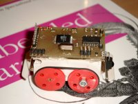

 To date, this is my most successful design. It is powered by an Atmel 8535, which means you can write fairly complex applications (8Kb flash). It has 4 tactical sensors, two eyes based on LDR resistors placed in a tube to have directional sensory, one RC5 Ir diode to be able to command the robot using a standard remote control unit and expansion bus on the top of the vehicle (Wireless module has been build).

## Introduction

This small robot measures 75x38x50 mm, and is powered by two [geared DC motors](http://www.ftb-bertsch.de/zip_pdf/produkte/ftb0030.pdf). Four NiMH cells, delivering 120mAh at 1.2 V each provide enough power for approximately 1 hour autonomy. The brains of the robot are made up of a AT90LS8535 running at 4MHz in a TQFP package. The motors are driven by a 74AC244, an octal buffer/line driver which I used to make 2 H-bridges.

The robot has 8 sensors; 4 touch sensors on each corner, two directional LDR light sensors, one IR sensor (TSOP1736, RC5 type) and one proprioceptive sensor indicating battery status. This sensor package seems to be enough to provide for rather intelligent behavior.

The robot has a tank like locomotion. I've grown fond of this type of locomotion as it provides traction on all wheels. Also, I really enjoy the skid steering.

The robot has 4 connectors; one to charge the batteries, another one to program the robot, a serial connector and one expansion bus, exposing 8 data lines, from which 4 our ADC capable. I've build a wireless module to put on top of the robot. More on that will follow, sufficient to say now that it uses a BIM2 transceiver from radiometrix. I've experienced some troubles getting the PCB ready for the PC host adapter, as I had to redo the PCB for a few times to get it _right_. Hence, I put the wireless module on a lower priority.

## Schematic

## Sample code

The next code is a small BASCOM program that can drive the MicroRover. It is a simple subsumption architecture, using 3 behaviors; photofobic, wandering and react to touch.

[Micro Rover example code](https://vandenbran.de/wp-content/uploads/2008/04/microroverbas.txt)

The most primitive behavior is reaction to touch, this behavior can subsume over all other tasks. Most of the time, the robot is in a photofobic state, it will wander of to a dark place by constantly steering in the most dark direction. Light values are measured by an ADC channel on the AVR MPU. Whenever the robot reads the light intensity on its two eyes, it'll power the LDRs for a short time and - enough time for the ADC to setlle - and then read out the intensities (lines 149-155). This intermittent powering of the LDRs prevent battery drain. When the light intensities falls below a certain threshold, the robot will sit happy until light levels are up again.

Whenever an object hits one of the touch sensors, the robot will try to turn away from the obstacle by reversing its direction and turning towards the opposite site of the touched sensor. If both front or aft sensors are touched, the robot just reverses direction, no turn takes place (lines 250-302).

After a random time, the rover wants to wander around. This wandering behavior has priority over its photofobic state, but lower priority than the touch behavior. When in wandering state, the robot is attracted to light. It will run of as fast as it can to brightest spot it can detect. The time that the robot wanders around is determined by another random number. I've found that this wandering state is very usefull for the robot to roam the complete room. If the wandering behavior would not be included, the robot would simply drive to a dark spot and sit there until light intensities are high enough to get it moving again. With the wandering behavior, though, the robot can sit idle on a dark spot, come to life again and run straight into the light. When the wandering behavior shuts down, the robot gets a panic attack and hurries to the nearest dark spot it can find (lines 337-374).

Lines 171 to 190 implement code to steer the robot via a TV remote control. The remote control can steer the robot in all 4 directions. Moreover, it can let the robot dump its internal state to its serial port. This can come in handy when debugging.

Although the battery level is already measured (lines 157-161) , by comparing a constant voltage drop over 3 diodes against the battery voltage, nothing is done with it. The idea is to have a small hardware extension on the robot that allows it to charge automatically. This extension can be made of just two wires that can connect to a docking station, composed of two metal plates. The idea is to let the robot navigate to a charging station as soon as battery levels drop below a certain treshhold. Moreover, the idea is to use the LDRs to navigate to the charging station. A LED, pulsating at a low enough frequency can be easily detected by the LDRs. The LED would indicate the position of the charging station.

## Video of Micro Rover
