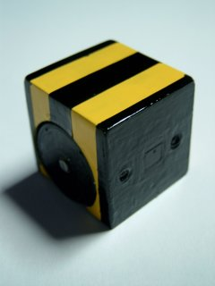
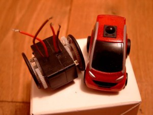
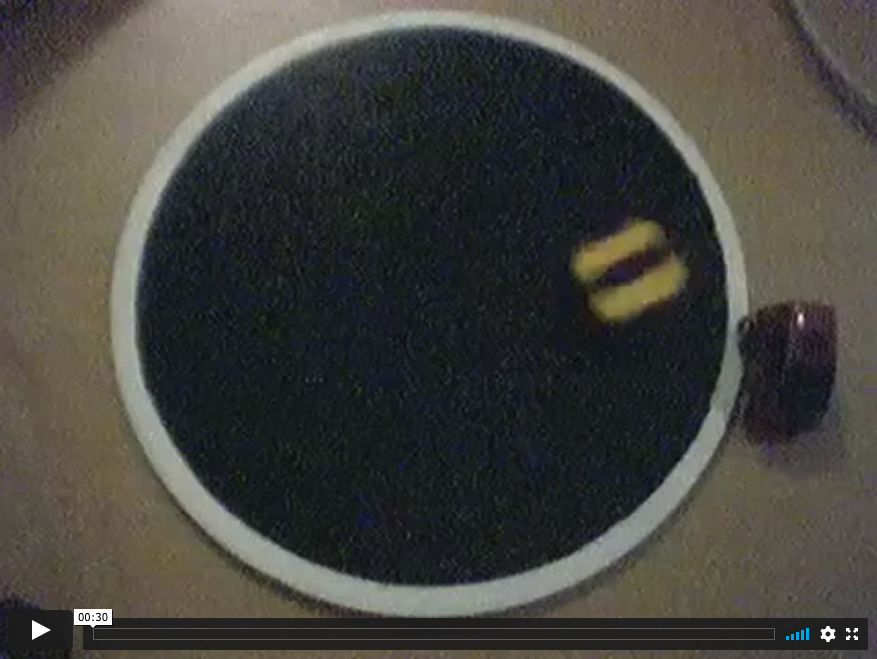

Killerbee is my first attempt at building a nano sumo bot. These bots have a maximum dimension of 25x25x25 mm and a maximum mass of 25 grams. Killerbee uses a custom build gearbox based on 2 small hobby servos. Its brains are a ATMega8 clocked at 16MHz. Power comes from a 90mAh LiPo battery. It has two line sensors at the bottom and one object sensor, on the front. A custom connector at the back provides an ISP programming interface a serial communication port and two terminals to charge the battery. A small SMD switch allows the bot to be switched on/off.

### Introduction

Killerbee is a nano sumo bot. These bots have a maximum dimension of 25x25x25 mm and must wheigh less than 25 grams. The idea behind sumo bots is to build a robot a that competes against another robot by trying to push the opponent out of a sumo ring.

Killerbee has the next specifications:

  * Custom gearbox from 2 miniature hobby servos
  * ATMega8 clocked at 16Mhz
  * 90 mAh LiPo battery
  * 2 line sensor on bottom plate
  * 1 object sensor on front, with 2 IR light sources
  * A proprioceptive battery sensor
  * Custom interface connector for programming, charging and serial communication
  * 25x25x25 mm, around 20 grams
  * About 10 minutes of autonomy

### The mechanics

Killerbee is build around a custom gearbox made from two small hobby servos. Here's a photo that compares the nano sumo gearbox to a pen-racer car.

 

The exterior of Killerbee are PCBs that also contain the electronics. The PCBs are 0.5 mm thick and single sided. The necessary paint provides the finishing thouch.

The custom connector is a standard 2.54 mm pitch female header connector. It provides the ISP interface, a serial interface and the charging interface. A small SMD switch allows one to switch on/off the bot.

### The electronics

Killerbee has an ATMega8 as its brains. This MCU runs at 16Mhz.

The front object sensor is an is471f from sharp. The IR sources are two surface mount IR LEDs. Both line sensors on the bottom plate are gp2s40. Power to all IR sources can be turned on or off. This is a major power saver, given the very small battery.

The proprioceptive sensor measures the voltage on the battery, by measuring the voltage drop over a constant voltage source - being 3 diodes put in series. Again, power to this voltage source can be turned of for power savings.

### The software

Killerbee is programmed in BASCOM-AVR. I choose this over AVR-GCC because it allowed me to do some rapid prototyping based on some code of my older bots. For the moment, i've created a small Killerbee library that handles all the low-level stuff, like sensory and motor driving.

I did notice one problem when first running Killerbee. it had the tendency of resetting itself when reversing motor direction. Probably this is due to a sudden power drop. The LiPo is a 90mAh HD (High Discharge) battery, but nevertheless it can't cope with the motors. I solved this by using a PWM driven motor driver. Also, I don't switch suddenly from one speed to another, but use a ramping algorithm.

The first sumo application I wrote for Killerbee is called scanner. Scanner is a simple algorithm. Killerbee starts scanning its neighbourhood by turning around slowly. Once it detects an object infront of its object sensor it will drive towards the object at full speed. If it encounters the white edge of the sumo ring, it'll back off. The edge detection has the highest priority, so it tries to stay within the ring at all cost. The behavior of the bot is very likelife, even with these simple rules. I normally start out by writing a few subsumption state machines, but for a sumo bot a simple algorithm seems to work fine.

You can have a look at a movie I made in which Killerbee tries to push a small pen-racer car from the sumo ring.

[Link to a small video](https://vimeo.com/516676377)

