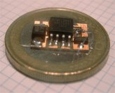
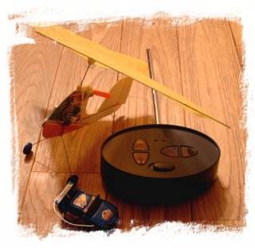
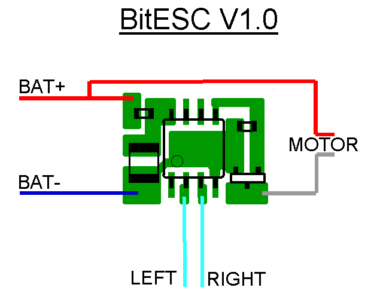
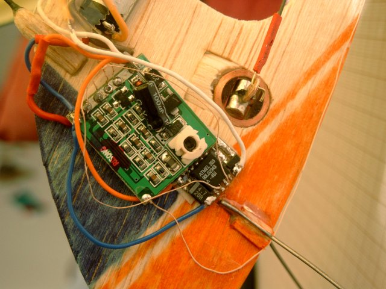
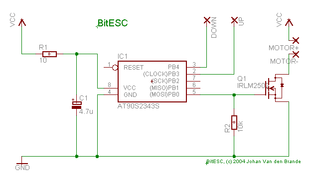

The BitESC is a small electronic speed controller for those little RC cars like the MicroSizer / BitChar-G. It can be used in a small RC plane to have some control over the speed of the motor. The speed of the motor ramps up or down, depending on which of the buttons on the transmitter you press. If no button is pressed, the ESC will ramp the throttle down to a stop after a few seconds. This safety net comes in handy when the plane flies out of transmitter reach.

## How to use

The BitESC weighs in at 0.3 grams, without leads, and has a size of 9 mm x 12 mm. It uses an IRLM 2502 to drive the motor and can pull 1.5 A continuous. The microprocessor used is an Atmel AVR 2343 which runs at 1Mhz.

To be able to use the BitESC, you'll first need to read about the different modifications required on either the transmitter and the reciever. You can read more about how to modify the receiver of a BitChar-G car at the following topics on rcgroups.com:

- [Bitcharger conversion](http://www.rcgroups.com/forums/showthread.php?t=74227)
- [Bitcharger receiver mods](http://www.rcgroups.com/forums/showthread.php?t=94563)
- [Bitcharger TX mods](http://www.rcgroups.com/forums/showthread.php?t=94107)

To get the best results, it is adviced to modify the receiver by adding a longer antenna. I use 1/8 of the wavelength, for 57MHz that gives an antenna length of approx. 63 cm. After extending the antenna, you should retune the receiver by adjusting the coil.

The best hack for the transmitter is to increase the power to the RF circuit and removing the cripple cap, if your TX has one.

This BitESC should cope easily with motor noise. I use a KP00 without a noise reduction capacitor on the Cootie and it works just fine. Although it is a very good idea to add a noise reduction cap to the motor.

The BitESC expects 5 leads to be soldered. The next schematic shows the wiring diagram. The negative of the motor is connected to the BitESC, the other lead goes to the plus lead of the battery (BAT+). The BitESC contains a small RC filter to filter out motor noise.

## Example

Here's a photo of my Cootie (Designed by [Ralph Bradley](http://www.parmodels.com/)), which I equipped with a BitChar-G receiver and my BitESC. The actuator is connected to the H-bridge on the receiver, which normally connects to the motor and provides forward and backwards motion. The BitESC is connected to the left and right channels. To be able to use the transmitter comfortably, you'll need to switch the controls.

## Schematic

{: dither="no" }

## Making a BitESC yourself

If you want to make the BitESC yourself, the next information should get you going. Here's the link to the PCB layout. Assembly code can be found below in the article.

- [PCB layout](https://vandenbran.de/wp-content/uploads/2008/05/bitesc.pdf)

Here's a printout of the assembly source.

    :::ASM
    ; BitESC
    ; (c) 2004 Johan Van den Brande
    
    .include "2343def.inc"
    
    .equ TIMEBASE_TICK = 15000
    .equ SAFETY = 25
    .equ PWM_MAX = 63
    .equ ESC_POS_MAX = 15
    
    .equ esc_bit = 0
    .equ down_bit = 3
    .equ up_bit = 4
    
    .equ PORTB_INIT = (1<<down_bit) | (1<<up_bit)
    .equ DDRB_INIT = 1<<esc_bit
    
    .def tmp       = R16
    .def esc_value   = R17
    .def esc_pos    = R18
    .def pwm_value   = R19
    .def safety      = R20
    
    .def timebase_l   = R24
    .def timebase_h = R25
    
    .macro loadesc
    ldi   ZL,LOW(2*esc_values)
    ldi   ZH,HIGH(2*esc_values)
    clr   tmp
    add   ZL,esc_pos
    add ZH,tmp
    lpm
    mov   esc_value, R0
    .endmacro
    
    .cseg
    .org $0000
    rjmp   main
    
    main:
    ldi      tmp,LOW(RAMEND)
    out      SPL,tmp
    
    ldi      esc_pos, 0
    ldi      safety, SAFETY
    ldi      timebase_l, LOW(TIMEBASE_TICK)
    ldi      timebase_h,   HIGH(TIMEBASE_TICK)
    ldi      tmp, PORTB_INIT
    out      PORTB, tmp
    ldi      tmp, DDRB_INIT
    out      DDRB, tmp
    
    loadesc
    
    loop:
    ; pwm
    ldi      tmp, PORTB_INIT | (1<<esc\_bit)
    cp      pwm_value, esc_value
    brlt   skip
    cbr      tmp, 1<<esc_bit
    skip:
    out      PORTB, tmp
    inc      pwm_value
    andi   pwm_value, PWM_MAX
    
    ; check timebase
    sbiw   timebase_l, 1
    brne   loop
    
    ldi      timebase_l, LOW(TIMEBASE_TICK)
    ldi      timebase_h,   HIGH(TIMEBASE_TICK)
    
    ; read input states
    sbic   PINB, down_bit
    rjmp   skip_down
    ; reset safety
    ldi      safety, SAFETY
    ; motor --
    cpi      esc_pos, 0
    breq   skip_down
    dec      esc_pos
    skip_down:
    
    sbic   PINB, up_bit
    rjmp   skip_up
    ; reset safety
    ldi      safety, SAFETY
    ; motor ++
    cpi      esc_pos, ESC_POS_MAX
    brge   skip_up
    inc      esc_pos
    skip_up:
    
    cpi    safety, 0
    breq   safety_powerdown
    dec    safety
    rjmp   safety_proceed
    safety_powerdown:
    cpi      esc_pos, 0
    breq   safety_proceed
    dec      esc_pos
    safety_proceed:
    
    loadesc
    
    rjmp   loop
    
    esc_values:
    .db   0,   2
    .db   4,   6
    .db   8,   10
    .db   13,   16
    .db   19,   23
    .db   27,   32
    .db   38,   46
    .db   57,   63
