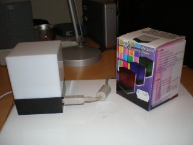
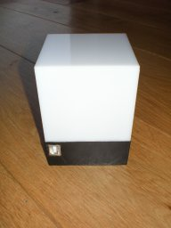
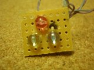
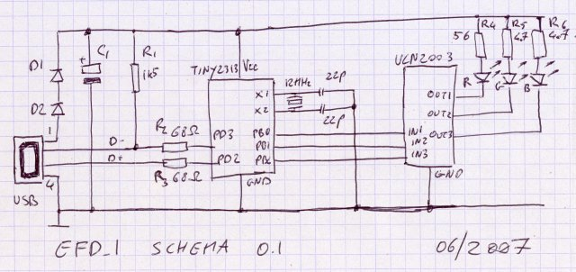
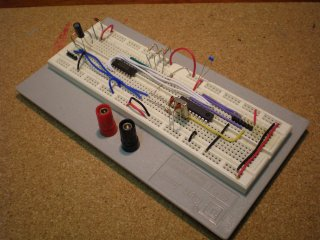
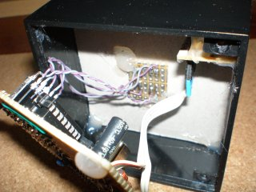
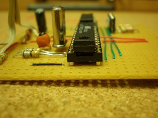
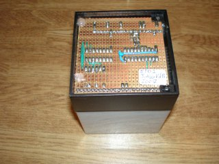

Recently I created an extreme feedback device from a LED cube. An extreme feedback device provides a rapid feedback cycle after a commit to the repository. Having a visual clue on the state of the project is very valuable. If introduced correctly it can boost productivity and morale within a team considerably.

### Introduction

Some time ago while browsing a local electronics store I stumbled upon a small LED cube that cycles its 3 color LEDS through some idyllic patterns. At that time I was setting up a refreshing development environment at my work, involving CruiseControlrb, Capistrano and Subversion for a new project involving some hardcore C development. I thought it would be nice to be able to convert this little toy into something that could be controlled by CruiseControlrb to signal success or failure of our build. Oh yes, an extreme feedback device!

### Choosing USB to interface a device

I read about these contraptions in the book 'Pragmatic Project Automation', where they hook up lava lamps to a computer to indicate failure or success of their build, and the idea caught on. However, there was never an excuse to really make such a device, until that new spiffy project came along. The question off course was how to interface the device with CruiseControlrb. Maybe a power switch of some kind, like a relay connected via a transistor or two to the parallel port? But, a parallel port off course is nothing anymore in the 21st century. It is vintage technology, not cool and wicked. The same is true for a serial connection; you have to be lucky to get a laptop with a serial connection now! A solution would be a USB to serial converted, that would be easy as well. I did do some parallel port and serial port interfacing in the past; why would I leave my comfort zone anyway? But then again, neither of these solution would be ubercool, nowadays a device needs a USB interface or else it belongs in a museum of some sort!

Luckily some smarter people than me created USB firmware for the Atmel AVR series of micro controllers. The firmware is written by the clever guys from [Objective Development](http://www.obdev.at/index.html), an Austrian software company. They have a dual licensing policy, which means that for non-commercial applications the license is free under GPLv2. For commercial purposes there are a few options, but all priced very fair. The Atmel AVR is a micro controller that I now and you can program it in C, something I know as well. But the software for the micro controller - called firmware - is only one half of the software equation, we also need to write a driver that can run on the host machine. That is, the computer to which the device gets connected. Writing a Linux driver is not a simple task, and is also not portable but again we can build on the shoulders of other people. Libusb is a library that makes it possible to write USB drivers in user land and that has the benefit that the code you write is portable to Win32 and OSX as well!

With all the puzzle pieces for the software out of the way it was time to start designing the hardware.

{: dither="no" }

### The hardware

The LED cube came with a small PCB with three LEDs, a few resistors and an integrated circuit beneath a small black blob. I took out the three LEDs and looked at the resistors on the PCB, I had the impression that the LEDs were connected to the integrated circuit directly, probably it contained three constant current sources and some pattern generator. Although I could reproduce a constant current source, I just went with the old trick of using a series resistor to limit the current through the LED. After some experimentation I came up with three good values for each of the colors red, green and blue. The AVR I choose, the ATTiny2313 can only sink 40mA per port and 200mA total and these are absolute maximum ratings. This was too little for driving the three LEDs concurrently. So I choose to put a driver integrated circuit in between, an ULN2003 which can sink up to 500mA. The part that is responsibe for handling the USB connection is a copy of the hardware reference implementation. In fact the schematic is surprisingly simple.

### The firmware

The firmware is actually quite simple, all the gory USB handling software is nicely hidden after an API. Basically we have an eternal loop which calls usbPoll() and handles a small state machine. The usbPoll function is needed for the USB handling and is part of the USB library. The state machine is responsible for driving some light patterns. When there is USB data available the function usbFunctionSetup gets called. It receives an array of 8 bytes, the same bytes you provide in the driver, which we'll discuss a bit further. The first byte is the 'command' and the second byte is a piece of data. There are four commands for the moment, two to switch any individual LED on and off and two other that allow a pattern to be started or stopped.

    :::C
    uchar   usbFunctionSetup(uchar data[8])
    {
        uchar param = data[2];
        switch (data[1]) {
            case 0: // ON
                LED_PORT |= param;
                break;
            case 1: // OFF
                LED_PORT &= ~param;
                break;
            case 2: // CYCLE ON
                cycle = param;
                break;
            case 3: // CYCLE OFF
                cycle = 0;
                LED_PORT = 0;
                break;
        }
    
        return 0;
    }

The eternal loop of the firmware is also simple:

    :::C
    for(;;) {
            usbPoll();
            c++;
            if (c > WAIT_DURATION) {
                c = 0;
                switch (cycle) {
                    case 1:
                        LED_PORT ^= 7;  // toggle all leds
                        break;
                    case 2:
                        LED_OFF(i);
                        i++;
                        i &= 3;
                        LED_ON(i);
                        break;
                    case 3:
                        LED_TOGGLE(0);
                        break;
                }
            }
    }

The biggest part is the handling of the patterns. Three patterns are defines; One flashes all the LEDs, another cycle through all LEDs and switches them on and off, producing a sort of running light, the third pattern just flashes one LED on and off. This LED happens to be the red LED, ideally to signal a problem or something similar.

### The driver software

The USB driver, running on the host machine, is made up of two parts. One part, the initialization, iterates over all connected USB devices to the host. As each device is identified by a unique number, we can find our LED cube device this way. Once we have a handle to our device, we can send it a value by using the usb\_control\_msg method, which just send a control message to our device and also is able to receive data from the device. Next to a control transfer, you also have bulk and interrupt transfers, but for our purposes a control transfer is all we need.

Actually, the core of our driver is just one line of code, wrapped in a function `efd_1_command`, it looks like:

    :::C
    int efd_1_command(efd_1_dev *handle, efd_1_cmd command, efd_1_param param)
    {
        unsigned char       buffer[8];
        return usb_control_msg(handle->device, 
                                          USB_TYPE_VENDOR | USB_RECIP_DEVICE | USB_ENDPOINT_IN,
                                          command, param, 0, (char *)buffer, sizeof(buffer), 5000);
    }

Once I abstracted away the code for the driver into a shared library, I wrote a small command line tool, called efd to be able to drive the LED cube from the command line.

### 

Once I got the driver and firmware ready, I was able to integrate the LED cube as an extreme feedback device by using the CCrb plugin system. Te plugin system calls a method in a plugin when the build failed or is fixed again. It can also receive a message when the build was success full. Instead of writing a support library to be able to use the driver from Ruby directly, I just wrapped the efd tool into the plugin by using a system call. Nothing fancy, but it does its job. Here's the code for the integration of efd into CCrb:

    :::Ruby
    #file: builder_plugins/installed/efd_notifier.rb
    class EfdNotifier
      def initialize(project = nil)
            CruiseControl::Log.event("EFD Ready", :info)
      end
    
      def build_finished(build)
            if build.failed?
                    efd("off 2")
                    efd("cycle_on 3")
            else
                    efd("cycle_off 3")
                    efd("on 2")
            end
      end
    
      def build_fixed(build, previous_build)
        efd("cycle_off 3")
        efd("on 2")
      end
    
      private
    
      def efd(cmd)
            command = "/home/projects/efd/efd1 #{cmd}"
            CruiseControl::Log.event("EFD: #{command}", :info)
            system(command)
      end
    
    end
    
    Project.plugin :efd_notifier

Place the above code in the file `builder_plugins/installed/efd_notifier.rb` under the CCrb installation directory.

### Conclusion

It is nice to see that the LED cube has become an integral part of the build process. We try to keep our main branch in good shape, that means that every time we commit something we keep an eye on the LED cube until the build and the first line of tests are run. What is important is to keep the importance of the LED cube. If it was always red, people would get accustomed to that. You need good hygiene on the status of the main branch if you want an extreme feedback to keep having an impact on the development cycle.

### Appendix

The code and schematics are hosted at google code: [http://code.google.com/p/extreme-feedback-device/](http://code.google.com/p/extreme-feedback-device/)

The AVR-USB solution I used: [http://www.obdev.at/products/avrusb/index.html](http://www.obdev.at/products/avrusb/index.html)

