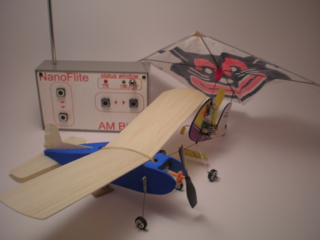
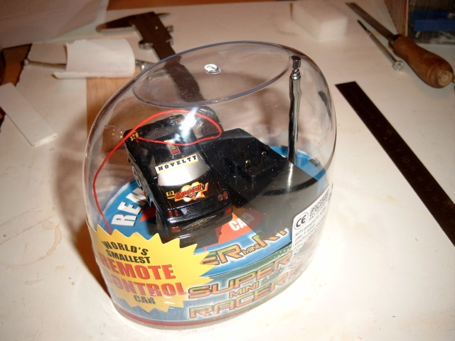
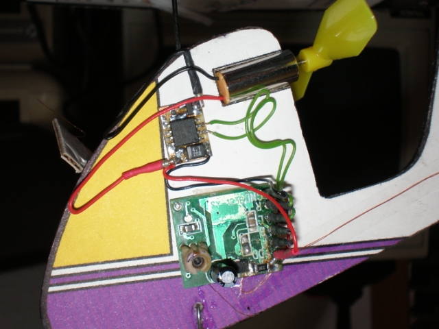
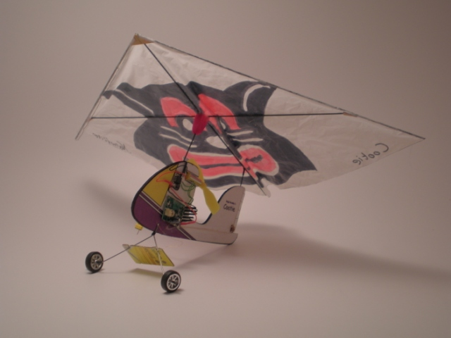
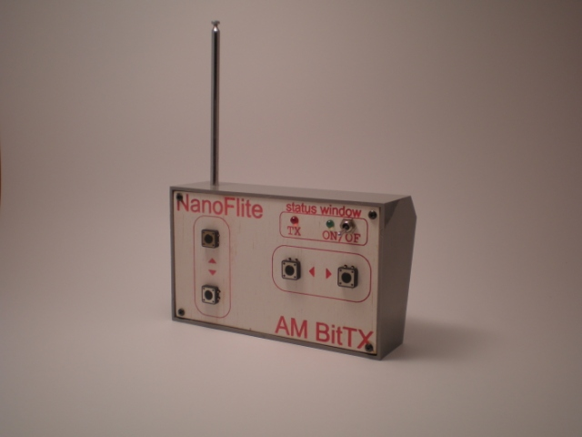
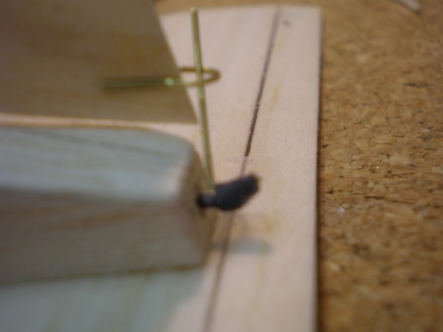
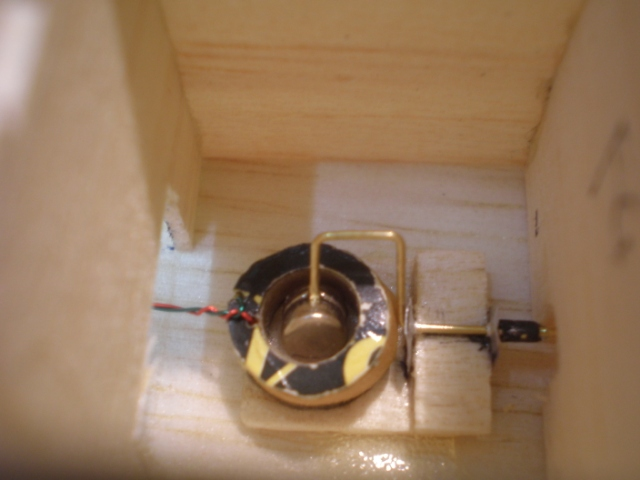

This winter I revamped my oldest indoor RC equipment, a few BitCar receivers and a hacked transmitter, to experience some lo-tech indoor fun. If you think about it, this equipment is not so different from the early equipment used at the dawn of the RC flying hobby. Most early RC planes flew rudder only, with a fixed amount of motor time, basically until the fuel ran out. I found some [great vintage footage](http://www.rchalloffame.org/Video/index.html) on the web that illustrates all the fun you can get from flying early day RC planes ;-)

My early indoor equipment has two channels. One for the rudder that is bang-bang, meaning it can only deflect full to the left or the right, and one for the motor. A [home-brew ESC](http://www.vandenbrande.com/wp/2005/10/bitesc-electronic-speedcontroller-for-bitcars/) gives some proportional control over the motor . To make it all look a bit more tidier, I soldered some small connectors to the receiver and ESC board . The advantage of this is that the components can be reused more easily.

I always have been a fan off vintage looking RC planes. So for this season I found two planes I wanted to build and fly with my vintage equipment. One of my favorites is definitely the 'Guided Mite'. This a design from the fifties meant for rudder only with a small combustion engine. Luckily for me, somebody was kind enough to [post the plans to rcgroups.](http://www.rcgroups.com/forums/showthread.php?t=863644)

The other plane is a rogallo wing design, named a cootie. You can find [the plans](http://www.bsdmicrorc.com/index.php?show_aux_page=5) at the fine site of Bob Selman. The rogalla wing is an early design delta wing and has some [nice history](http://en.wikipedia.org/wiki/Rogallo_wing) about it. Also, I just like its retro-look.

After building these two planes, I still had a problem with the transmitter. I still used the transmitter box that came with the BitCar and it was just not good looking. So I decided to do a DIY case for the transmitter. I milled a front panel on my CNC mill out of a piece of white painted wood. After having milled the front plate I applied some red acrylic paint to it and wiped the excess paint away. On the milled parts the paint stuck to the wood, so you get red letters on a white background. Some large keys and a big switch add to the vintage look.

For the guided mite I tried to adhere to the original design as good a I could with the equipment I had. The early RC gear had what was called an escapement. If you take a closer look at the plans for the guided mite you might figure out how it all worked. But basically it was a system that allowed for the next sequence of steering: left-neutral-right-neutral-left-... It was all powered by a wound-up rubber band! So you basically only had a limited number of steering commandos. After receiving an electric pulse, a pin was pulled down by a magnet and allowed the rubber band to unwind a quarter of a turn. The rubber band was connected to a yoke that would in turn drive the rudder.

In my incarnation of this system I used an actuator, basically a coil with a magnet inside of it. This magnet can turn a few degrees left and right under impulse of the magnetic field of the coil. Basically already a bit more advanced than the original equipment, because I just can choose with direction to steer without having to quickly skip the other direction.

The guided-mite ended up with a wingspan of 29cm and a total weight (ready to fly) of 24grams. The Cootie has a wingspan of 33cm and weighs 17grams ready to fly.

I really enjoyed building and flying these two indoor planes. Don't ask me why, but I just have a sweet spot for old RC models.
