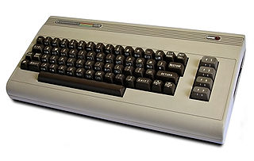
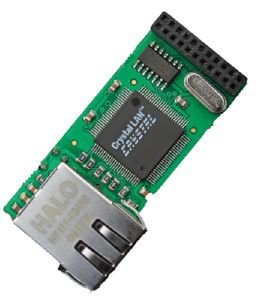
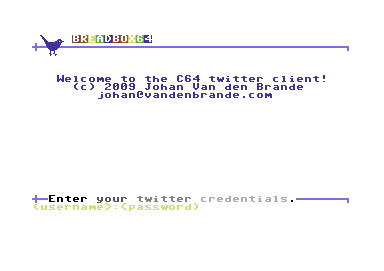
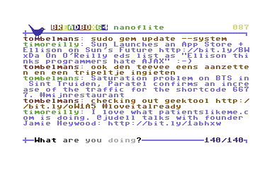

BREADBOX64 is a twitter client for the C64/128 which allows you to tweet from a real C64 and show your friends timeline. It uses Contiki, a very nice embedded OS, and the MMC Replay cartridge with the RR-Net add on for the physical connection to the net. 

# About

The commodore 64 will always have a sweet spot in my heart. Although not my first computer - that would be an ADAM Coleco - the C64 was the first system on which I really started to develop software in assembler. Now, some 20 years later I still tinker with it and so why not combining a 21st century phenomenon, called social micro-blogging with a 20th century vintage computer!

# The C64

The C64 was introduced by Commodore in august 1982, it is 25 years old now. It had astounding graphics and sound capabilities for its time, but if you look at them now they are a bit outdated. The CPU, a 6502 from MOS Technologies, runs at 985Khz, the maximal screen resolution is 320x256 and it has 64KB of RAM.

[http://en.wikipedia.org/wiki/Commodore_64](http://en.wikipedia.org/wiki/Commodore_64)

# The Ethernet adapter

Even today there is a vibrant scene around the C64. There are even hardware add ons being produced right now. Most add ons take the form of cartridges that plug into the back of the machine. One of these is the MMC replay cartridge that, among others, can add ethernet capabilities to the C64 via a daughter board RR-net.

[http://www.c64-wiki.com/index.php/MMC_Replay](http://www.c64-wiki.com/index.php/MMC_Replay)

# The OS

As an underlying OS (yes, an OS that runs on the C64 is possible), I use Contiki. Contiki is an open source, highly portable, multi-tasking operating system for memory-efficient networked embedded systems and wireless sensor networks. More specific, I use their uIP stack to communicate over the Internet with the C64. It is definitely worth looking at. Actually the breadbox64 project grew out of my interest in Contiki to use it as a basis for some real projects later on.  You can find more about [Contiki on their official page](http://www.contiki-os.org/).

# The Compiler

CC65 is a Small C compiler or the 6502. The 6502 is the CPU found in the C64 and a lot of other computers of that era, e.g. the Apple \]\[. It is a complete compiler tool chain with C compiler, assembler, linker and archiver.

[http://www.cc65.org/](http://www.cc65.org/)

# The result

{: dither="no" }

The welcome screen, ready to log in!

{: dither="no" }

Twittering from a C64.

With BREADBOX64 you can post status messages and view your friends timeline. The timeline refreshes every two minutes.  After starting you provide your twitter username and password separated by a colon. After pressing enter, the timeline is retrieved and shown. At the bottom of the screen there is an input field for you to type aq status message. Pressing enter will post that message to twitter.

You can run BREADBOX64 on a C64 emulator. I use [VICE](http://www.viceteam.org/), because that one supports networking. However, you can better test it on a real system if you have the hardware ready at hand. If so, copy the D64 to a real disk, put it in your 1541 and go ahead!

If you want to try it yourself, you probably need to find your own ip.cfg file. This is a contiki.cfg file that contains IP, gateway etc. You can generate one overhere: [http://cbm8bit.com/contiki/](http://cbm8bit.com/contiki/). The one supplied uses 192.168.1.128 as IP and 192.168.1.1 as gateway.

Although primarely programmed for the C64 BREADBOX64 should compile for other systems using Contiki. The only C64 specific code relates to the little bird at the top of the screen, which is actually a sprite.

If you fancy this piece of software, you can follow [breadbox64](http://twitter.com/breadbox64) on twitter! I'll give some status updates on how this project evolves...

[breadbox64 source code](https://sourceforge.net/p/contikiprojects/code/HEAD/tree/vandenbrande.com/twitter/)
