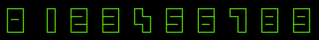

This a port of the 2048 game to the CBM PET 4032. This game is part of a work to port 2048 to the C64, VIC20 and 4032. There are not many new games being released for the 4032, which is understandable given that it is an ancient machine which was created as a business machine and not as a gaming console. However, I find it a very challenging task to write games for this very limited platform. 

## The PET CBM 4032

This year I had the opportunity to acquire an old 8-bit computer from 1980, namely the [PET/CBM 4032](http://oldcomputers.net/pet4032.html). This machine is one of the later generations of the PET series of Commodore computers and was mainly intended for the business market.

PET/CBM 4032 - 12" screen.

There is a reason why I choose to buy a PET 4032 and not one of the older versions, like the PET 2001 or 3000 series. The PET 4032 is one of the first CBM machines that  has a [Cathode Ray Tube Controller (CRTC) 6545  chip](http://www.6502.org/users/andre/petindex/crtc.html) on board and that has an internal piezo speaker. This means that very primitive video effects are possible with the 4032 and you have the possibility to play some one bit music through the internal speakers.  I also had the opportunity to buy an 8032, which is basically the same machine but has 80 columns of text instead of 80. I did not do this because I think the width of 40 characters is better suited for my purposes and more closely resembles the capabilities of the other 8-bit machines of Commodore. Interestingly, you can convert a 4032 to an 8032 by putting in more RAM, some other ROMS and rewiring some jumpers. They both have the same motherboard.

## 2048

The game 2048, created by [Gabriele Cirulli](http://gabrielecirulli.com/articles/2048-success-and-me), is a very popular puzzle game based on [1024](https://itunes.apple.com/us/app/1024!/id823499224) and another game with the name [2048](http://saming.fr/p/2048/). Although it very much resembles [Threes](http://asherv.com/threes/), the author of the game did not know about Threes when he started development on 2048. 2048 is a slide puzzle where you have to pair numbers. Numbers that are paired add up, creating ever increasing numbers of the power of two. The goal is to reach the number 2048.

## A 2048 core in C

I always reach for the [CC65 tool suite](http://www.cc65.org/) when coding for the 8-bit Commodore range of computers. CC65 is the best tool suite to develop for the 6502 range of CPUs if you ask me. It has a fully functional C compiler with great macro support and a very fine assembler as well. But more importantly, it comes with a super standard library as well. Originally developed by Ullrich von Bassewitz it is now maintained by [Oliver Schmidt](http://cc65.github.io/cc65/). The goal of this project was to make a puzzle game that has a machine independent game core. Written in ANSI C89, the game core can easily be ported to other  architectures as well. At this moment I have written [a version for the C64](http://csdb.dk/release/?id=130220) and one for the PET/CBM 4032. In my effort of making the code more or less platform independent, I opted for a solution that provides link time substitution of the screen drawing facility.  In practice, this means that the main code and game core are the same for each platform. The main program then calls hooks at certain code sections to drive the screen. Below are some lines of code from the 'screen.h' header file, showing the API used and hooks being called.
    
    :::C
    #ifndef __SCREEN_H__
    #define __SCREEN_H__
    
    #include "tile.h"
    
    /**
     * @brief Draws a tile on the screen.
     *
     * This function draws a cell on the screen, using the tile to get to the location and value.
     *
     * @param tile Pointer to the tile that needs drawing.
     */
    void
    screen_draw_cell(tile *tile);
    
    /**
     * @brief Draws the winning message or screen.
     *
     * This function is called when the goal of 2048 is reached. Use it for drawing a winning
     * message.
     */
    void
    screen_draw_you_won(void);
    
    /**
     * @brief Draws a game over message.
     *
     * This function  is called when the game is over, i.e. when no more moves are available.
     * It is not called when to goal is reached.
     */
    void
    screen_draw_game_over(void);
    
    /**
     * @brief Draw the message 'restart y/n?' or similar and recobstruct screen afterwards.
     *
     * This function gets called when the user presses the 'Q' key and is used to ask for a game
     * restart. The function should return true when a restart is needed.
     * This function needs to reconstruct the screen area it destroyed.
     *
     * @return bool True when restart needed.
     */
    bool
    screen_draw_and_ask_restart(void);
    
    /**
     * @brief First function called after game start. Use to show title screen.
     *
     * This function is called first and should be used to show the title screen.
     * You can do a keyboard press check here as well to proceed.
     * You can use this to do some platform specific setup stuff.
     * This function is called once during the lifetime of the game.
     */
    void
    screen_title(void);
    
    /**
     * @brief Use to initialize the playing field.
     *
     * Use this function to setup the grid.
     * This function is called once during the lifetime of the game.
     */
    void
    screen_init(void);
    
    /**
     * @brief Use to reinit the screen after wining or game over.
     */
    void
    screen_reinit(void);
    
    /**
     * @brief Draw all the tiles.
     */
    void
    screen_draw(void);
    
    /**
     * @brief Draw the score.
     *
     * This function draws the score.
     *
     * Use the the functions game_score() and game_best_score() to get the values.
     */
    void
    screen_draw_score(void);
    
    #endif

(Start rant) A lot of (professional) embedded C code I see when consulting still makes use of preprocessor code substitution for platform independence. If we can do this properly for an old 8 bit machine, we surely can do this better as an industry as well. (End rant)

## PETSCII

The CBM PET computers have no graphical screen mode, only a monochrome character mode is supported, giving a display of 40x25 characters. PETSCII, also called CBM ASCII, is a custom character set developed by Commodore, based upon ASCII. There is a character set available with lower and uppercase characters and another one which has only uppercase characters, but contains graphical symbols as well. The latter makes it possible to create some crude graphics. In 2048 I used these graphical characters to create the grid and the numbers on the tiles.

## Rendering numbers in PETSCII

There are many ways to use the PETSCII graphical characters to create fancy drawn numbers. I settled upon using some rectangular based shapes to draw the numbers. Using the 10 characters shown below, I used them to create the numbers 0 to 9.

{: dither="no" }

This results in numbers that are 3 characters wide and 5 characters high, as shown below. The screen width of the 4032 is limited to 40 characters, this means we have 10 characters to our disposal to draw a tile, including the grid. The number itself can only be 9 characters wide, so we can also draw a grid. That would limit the amount of digits per tile to 3, too little for representing the number 2048.

{: dither="no" }

The numbers 0 through 9, drawn using the graphical characters.

Luckily, we can condense the numbers, eliminating the space between them. For doing this, I wrote a routine that merges numbers and glues them next to each other. For doing this, I introduced a data structure where each of the 10 graphical characters is mapped to a binary representation of 4 bits. The 4 bits stand for top, bottom, left and right. If you look at the used characters, they each can touch the top, bottom, right and left side of the space they use. You can look at them as little tubes that have exit points at the different sides of the rectangle they occupy. Merging them is now a simple operation of a bitwise 'OR' function.

{: dither="no" }

Merging PETSCII characters.

As an example let us connect the vertical bar '|' and 'T' shaped character. The '|' has exit points at the top and bottom, giving bit pattern '1100'. The 'T' has exit points left, right and bottom, giving bit pattern '0111'. A bitwise 'OR' between both bit patterns gives back pattern '1111'. If we look at the table, this results as the '+' sign.

{: dither="no" }

The number 8192, printed out in condensed format.

The same technique of merging is also used to draw the grid. I wrote a horizontal and vertical line routine that does not overwrite the underlying lines, but merges them, giving nice crosses at the intersections. Here's the code that shows the heart of the merge routine. The variable s points to a location on screen, i.e. the existing situation. The variable 'data' points to the new character to be merged with the existing one. The routine '_char\_to\_code_' returns the bit pattern as described above for the given character. The routine '_code\_to\_char_' does the opposite, returning the character that corresponds with this bit pattern. When '_char\_to\_code_' encounters a character it does not understand, it will return a value with bit 7 set to one, in that case we do not merge, but just return the given character in '_data_'.

    :::C
    static char merge(char *s, char data)
    {
       char new;
    
       new = char_to_code(*s) | char_to_code(data);
    
       if (new & 0x80) {
         return data;
       }
    
       return code_to_char(new);
    }

This merging comes at a computing cost, so for the game I draw the condensed numbers 2, 4, 8, 16, 32, 64, 128, 256, 512, 1024 and 2048 in an offscreen buffer and use them as tiles during game play.

## 2048 for the 4032

At the moment I'm writing this blog post I have version ready for the C64 and CBM PET 4032.

[The code is available on github](https://github.com/nanoflite/2048-cc65), so you can a look on how it is all made. A compiled version is available as well. You do not need a real CBM PET 4032 to test it if you want. An excellent option is to use the [VICE emulator _xpet_](http://vice-emu.sourceforge.net/) for this.

[Download the game from itch.io](https://nanoflite.itch.io/2048)

[Here's a movie of the game](https://vimeo.com/518146239) in action on a PET 4032... enjoy the green.

