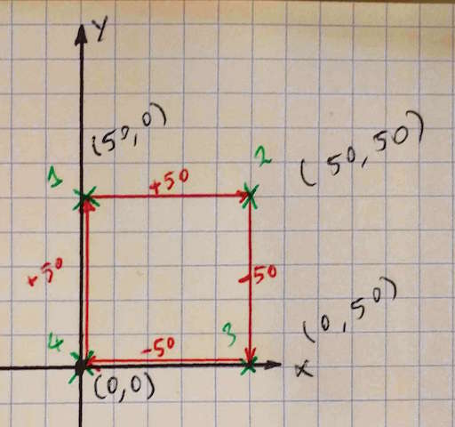
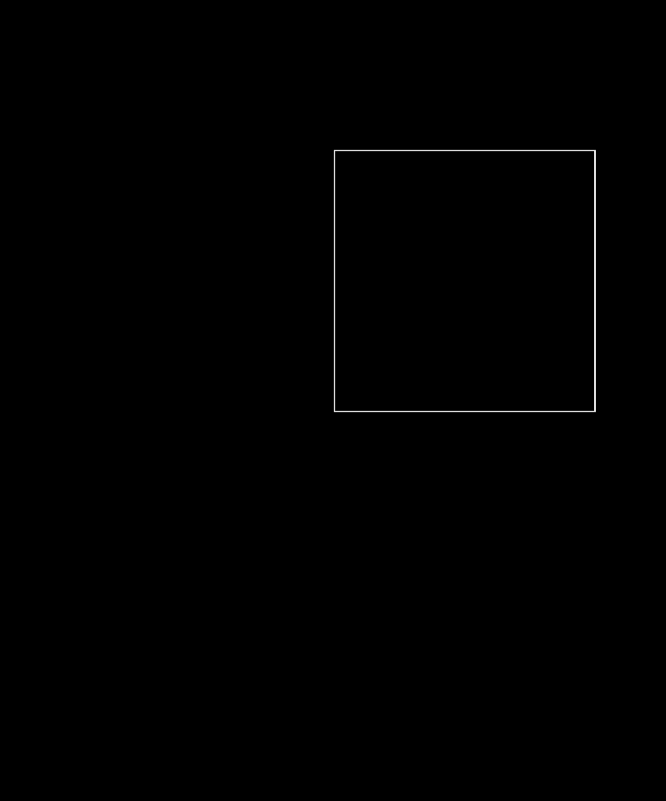
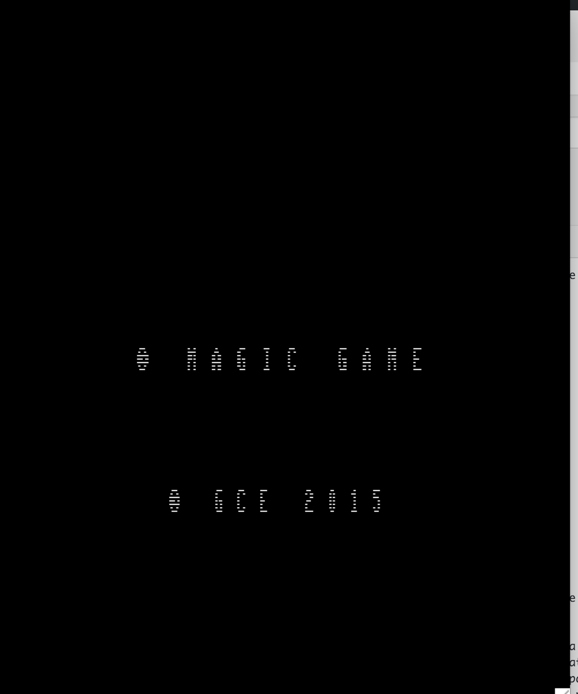
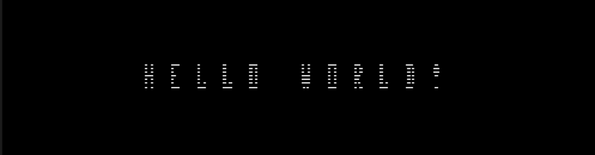

Last time I talked about setting up a toolchain for Vectrex development using CMOC, a C compiler for the 6809. This time we'll write some code to display dots, lines, rectangles and text. We'll also discuss a Makefile you can use for your own project and show you how to customize the startup screen of your Vectrex application. This post shows you that there is no magic involved in writing applications for the Vectrex.

### Let's draw a rectangle with 4 dots

Here's a snippet of code to draw a rectangle using 4 dots.

#include <vectrex/bios.h>

int main()
{
  while(1)
  {
    wait\_retrace();
    intensity(0x7f);
    dot( 50, 0);
    dot( 0, 50);
    dot(-50, 0);
    dot( 0, -50);
  }
  return 0;
}

The dot function sets a dot relative to the current location of the beam, which can sound a bit confusing. So let us step back a bit, because if you understand how the Vectrex works, then this will make more sense.

The Vectrex uses two integrators to position the electron beam, one for the X and the other for the Y position. If you position the beam to a certain location, then the integrators move to a new value, up or down depending on the end values. These two integrators contain the last value where the beam was located. Now it possible to reset the beam to the center of the screen, but that takes time. That is because the integrators move to a certain position by charging a capacitor, and charging a capacitor takes time. Therefore, it is faster to move from point to point in a relative fashion instead of constantly resetting the beam and positioning again.

On a real Vectrex you have to reset the beam from time to time or you get a drift on the values, the inaccuracies build up over time.

Here's a drawing that explains the relative drawing a bit. The first dot placed is located at absolute position (50,0). For the Vectrex, Y-coordinates always come first, second is the X-coordinate. Relative this means go up 50 and right 0. The next dot moves the beam 0 in the Y direction, but 50 in the X position, starting from that last dot. So we end up with absolute position (50, 50).

The 'wait\_retrace' should become clear as well now. It does some house keeping and moves the beam to the center of the screen.

The 'intensity' function sets the intensity of the electron beam, in this case to 0x7f, which is the maximum.

Here's a code snippet that uses the 'dots' function to draw the 4 dots. The 'dots' function allows you to draw a list of dots with one function call.

#include <vectrex/bios.h>

#pragma const\_data start
char thedots\[8\] = {
  50, 0,
  0, 50,
  -50, 0,
  0, -50
};
#pragma const\_data end

int main()
{
  while(1)
  {
    wait\_retrace();
    intensity(0x7f);
    dots(4, thedots);
  }
  return 0;
}

 

The 'pragma' tells the compiler that the data is of the type constant data. As it is data that only needs to be read, it can be placed in ROM and does not need to be loaded into RAM. That is a nice feature, because RAM is sparse on the Vextrex with 1K also because that 1K is used a lot by the BIOS routines.

Let's automate the build with a Makefile

Building the code above can be done via the command line:

cmoc --vectrex --verbose explore\_1.c

Although that works, it is more convenient to create a Makefile for this. Here's my template for a Vextrex project Makefile.

\## Makefile for cmoc and vectrex

NAME = dots

TARGET = $(NAME).bin
SOURCE = $(NAME).c

CC = cmoc
CFLAGS = --vectrex --verbose

VX = vecx

all: $(TARGET)

$(TARGET): $(SOURCE)
@ echo "CC $<"
@ $(CC) $(CFLAGS) $<

run: $(TARGET)
@ $(VX) $<

clean:
@ echo $@
@ rm -f $(NAME).{bin,i,lst,asm,hex}

# (\\/)
# ( ..)
# C(")(")

 

The only thing that should change is the NAME of the program. As CMOC can't work with multiple compilation targets, it only supports one object file, this is basically all you need.

There is an extra 'run' target, which allows you to run the app in an emulator as well.

### The rectangle, but now  with lines

Let's first draw a rectangle using 4 lines.

#include <vectrex/bios.h>

int main()
{
  while(1)
  {
    wait\_retrace();
    intensity(0x7f);
    move(0,0);
    line( 50,   0);
    line(  0,  50);
    line(-50,   0);
    line(  0, -50);
  }
  return 0;
}

 

First we have to move the beam to the center of the screen, using the 'move' function. But wait, we said the 'wait\_retrace' function does that as well? Yes, that is correct, but the 'wait\_retrace' function leaves the integrators in zero-mode, which means nothing can be drawn. The 'move' function call also enables the integrators, next to moving the beam to the provided location. In the case of the 'dot' function, that was not necessary as this function does a move, followed by switching on the electron beam and wait for short period.

Next, we draw the four lines and again we use relative coordinates for the lines.  Just as with the 'dot ' and 'dots' function, we have a 'line' and 'lines' function. Here's an example of using the 'lines' function to draw a rectangle.

#include <vectrex/bios.h>

#pragma const\_data start
char rectangle\[10\] = {
    // These are relative coordinates.
    50, 0,
    0, 50,
    -50, 0,
    0, -50
};

char center\[2\] = {
    // We also take the middle point of the rectangle which we move to before drawing. 
    -25, -25
};
#pragma const\_data end

int main()
{
     while(1)
     {
        wait\_retrace();
        intensity(0x7f);
        move(center\[0\], center\[1\]);
        lines(4, rectangle);
     }
     return 0;
}

 

The lines function takes a list of relative coordinates. What we do here as well is to first move to the center of the rectangle, so that the actually draw of the rectangle is nicely centered on the screen.

### Customizing the startup screen

A ROM cartridge for the Vectrex has a header that contains information about the contents stored on the cartridge. This header information includes title, title music and copyright together with some coordinates as to where to display the title and the font size of the title.

To make these accessible in C, I opted to use pragmas for that: vx\_title, vx\_music, vx\_copyright, vx\_title\_pos, vx\_title\_size.

For some reason, the Vectrex expects Y as the first coordinate, so we adhere to this convention in the C code as well. A Full Vectrex header definition would look as follows:

#pragma vx\_copyright "2016"
#pragma vx\_title\_pos 0,-80
#pragma vx\_title\_size -8, 80
#pragma vx\_title "g MAGIC GAME"
#pragma vx\_music vx\_music\_1

The 'g' in the title stands for a copyright sign. The 'vx\_music\_1' points to a location in memory where a song is defined. This one is the standard startup music. It is possible to define your own song, but that is probably for another article as I have not toyed with that yet.

### Let us show some text

#include <vectrex/bios.h>

int main()
{
  while(1)
  {
    wait\_retrace();
    print\_str\_c( 0x10, -0x50, "HELLO WORLD!" );
  }
  return 0;
}

The function 'print\_str\_c' displays a C string at a certain location on the screen. What you see is that the display of the text is wrapped in a while loop. What follows is true for all Vectrex drawing routines, but I think mentioning it is worthwhile. Why do we need to constantly print out the text, or constantly draw all the vectors again, even for a static image? The reason for this is that the Vectrex has no image buffer, vectors are drawn on the go and light up the fosfor on the CRT where the electron beam hits the screen. The fosfor has some afterglow, but quickly the image disappears. So to have the illusion of a steady image, we have to refresh the screen constantly.  The text display on a Vectrex is a bit odd, as the text seems to be a bitmapped font and yes, it actually is. The text is drawn by shifting font data, line-by-line to a shift register. This output of this shift register controls if the beam is on or off. This also means that the Vectrex is capable of showing bitmapped graphics if we do the same trick in our software.

### Show text with vector lines

It is also possible to draw text with lines. We have seen the 'lines' function and given a vector list that contains the definition of some letters it is possible to draw letters this way. I do not have an example ready, but you get the idea.

### Rotate that rectangle

Now let us do something nice with the rectangle. The Vectrex has BIOS functions that help in rotating a vector drawing. How cool is that?

#include <vectrex/bios.h>

#pragma const\_data start
char rectangle\[10\] = {
  // These are relative coordinates.
  50, 0,
  0, 50,
  -50, 0,
  0, -50,
  // We also take the middle point of the rectangle which we move to before drawing.   
  -25, -25
};
#pragma const\_data end

int main()
{
  int8\_t angle = 0;
  char rotated\[10\];
  while(1)
  {
    wait\_retrace();
    intensity(0x7f);
    rotate(angle, 5, rectangle, rotated);
    move(rotated\[8\], rotated\[9\]);
    lines(4, rotated);
    angle++;
  }
  return 0;
}

We store the middle point of the rectangle and rotate that one as well, his allows us to show a rotating rectangle that spins around its center. The call to rotate a vector is surprisingly simple, we just have to provide it with the angle in the range of 0 to 255, the number of points to rotate, the source array and next the destination array. As we can see, the source array can be stored in ROM, but the destination array has to be stored in RAM.

\[embed\]https://youtu.be/XDTfgguy3Xc\[/embed\]

### Summary

In this post I showed you some BIOS routines to draw dots and lines for the Vectrex. But as you'll have noticed there is a lot more to explore still. We didn't touch on playing and creating music, handling the joystick or more advanced topics like displaying vector fonts yet. Maybe I'll do a follow-up post on these specific topics.
