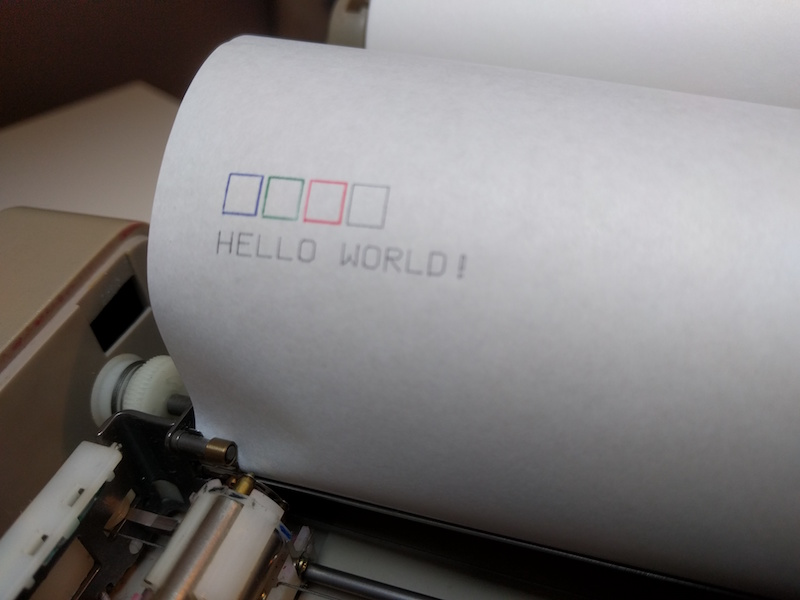
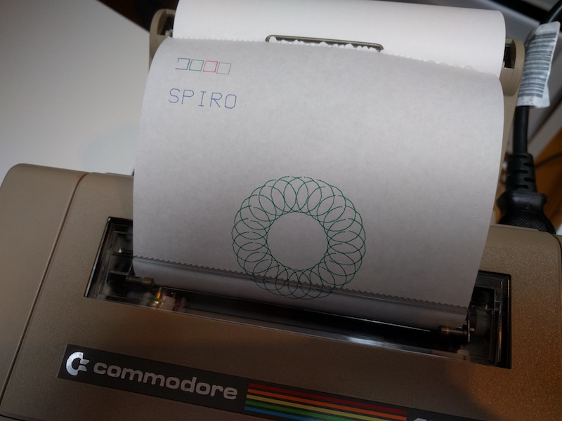
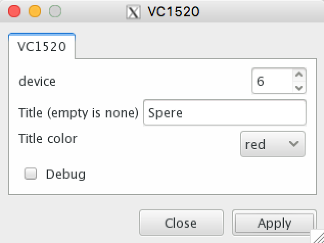
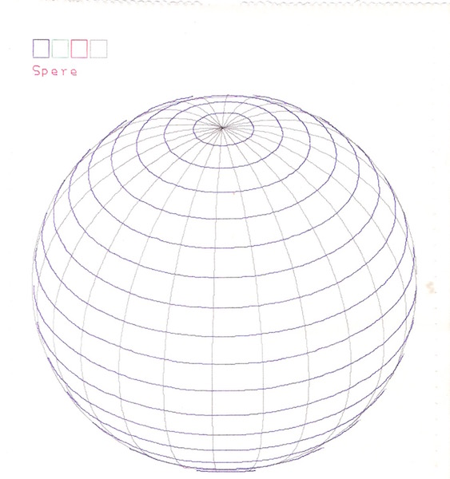
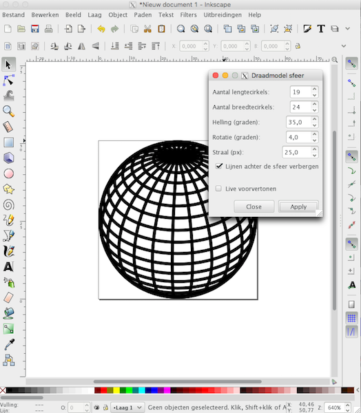
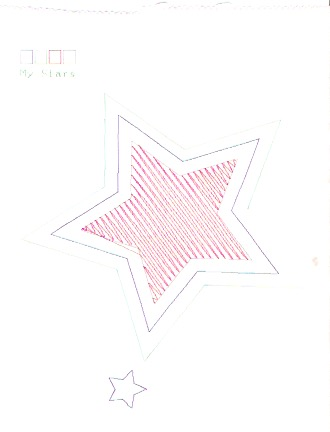
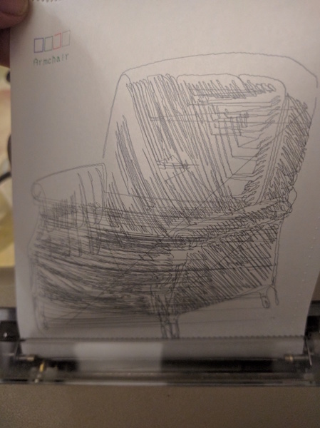
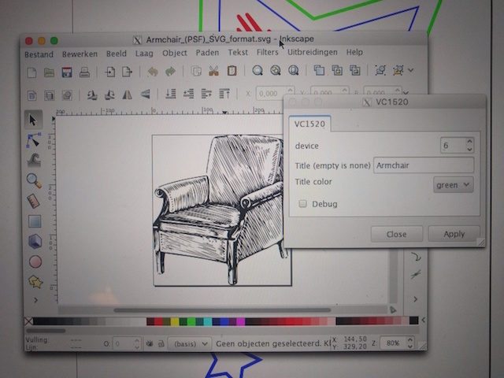
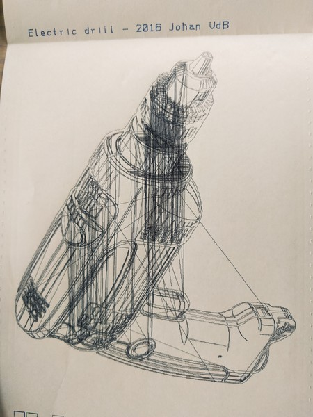

I'm a fan of old computers and their peripherals, actually I have a small collection of mostly Commodore equipment. One of my favorite peripherals is the VC1520 plotter printer. In this post I'll show you how you can use my Inkscape extension to drive the VC1520.

I bought the VC1520 around ten years ago, when collecting retro computers was not yet that hot. I do not remember the exact price I paid for it, but I think it came with a big pile of C64 material I bought for a few euros.

A few months ago I stumbled upon Björn Hutmacher who was offering xum1541 boards via Facebook. Basically it is a USB to IEC adapter. IEC is Commodore's version of serial IEE-488 bus protocol ([https://en.wikipedia.org/wiki/Commodore\_bus](https://en.wikipedia.org/wiki/Commodore_bus)). The IEC bus was for the C64 (and VIC20) what USB is now, a way to connect and talk to peripherals.

This rekindled my interest in doing something with the VC1520. I took the VC1520 out of storage and noticed that it was broken. There is a nearly 100% failure rate on one the pinions driving the plotter pen carriage. After some searching I found a website where I could order replacement pinions and a new set of plotter pens ([http://www.best-electronics-ca.com/](http://www.best-electronics-ca.com/)). So last month a package came in with replacement pinions and pens, and I started on fixing the plotter.

Next up was the software for driving the plotter. Luckily, there is OpenCBM, which is an open source driver for the CBM bus ([http://spiro.trikaliotis.net/opencbm](http://spiro.trikaliotis.net/opencbm)). Although theoretically supports all types of devices, most of the tools are geared towards using drives. One of the tools is 'cbmctrl', which is used to send commands to external devices. This was enough to start experimenting with the plotter. Here's an example to plot a 'Hello World' message.

#!/bin/bash

cbmctrl lock 
cbmctrl listen 6 0 
cbmctrl put "HELLO WORLD!" 13 
cbmctrl unlisten 
cbmctrl unlock 

\[caption id="attachment\_521" align="aligncenter" width="800"\] HELLO WORLD\[/caption\]

OpenCBM comes with a shared library, and with some Python and a C-types wrapper around it, I was able to brew up [a driver and a VC1520 module for the plotter](https://github.com/nanoflite/vc1520py). This allowed me to write some cool little programs.

Hello World

from VC1520 import VC1520

plotter = VC1520(6)
plotter.lower\_case(True)
plotter.puts("Hello World!")

Spirograph

import math
from VC1520 import VC1520

plotter = VC1520(6)

L = 30
R = 80

plotter.reset()
plotter.color('blue')
plotter.size(2)
plotter.write("\\rSPIRO")
plotter.move(240, -200)
plotter.set\_relative\_origin()

plotter.color('green')
for J in range(0, 360, 15):
    for I in range(0, 360, 10):
        X = R\*math.sin(J\*math.pi/180)+L\*math.sin(I\*math.pi/180)
        Y = R\*math.cos(J\*math.pi/180)+L\*math.cos(I\*math.pi/180)
        if I == 0:
            plotter.move\_relative(X, Y)
        else:
            plotter.draw\_relative(X, Y)

plotter.move\_relative(0, -100)

\[caption id="attachment\_520" align="aligncenter" width="800"\] Spiro\[/caption\]

But this way, you still need to write Python code to get something done. It would be easier if you could just plot some vector images from a drawing program. Now, for some of my Fablab work I use Inkscape, which is a cool open source vector drawing tool with a Python extension API. And now it gets interesting as all parts start to come together. We have a Python library to talk to the VC1520 and a vector drawing application with Python build in!

I started searching for some existing Inkscape extensions and after looking at a few of them I modelled my Inkscape extension after a [dxf output](http://www.bobcookdev.com/inkscape/inkscape-dxf.html) and [silhouette cutter](https://github.com/fablabnbg/inkscape-silhouette) extension.

After some nice detours in a bit of vector math using the 'simpletransform', I think I succeeded in building a usable extension. So, let us have a look at how you use the extension.

Installation should be easy. First you need to make sure you have opencbm installed. As I'm on OSX, I used brew to install opencb by typing `brew install opencbm` in a terminal window.

Next, you need to install the Inkscape extension from [https://github.com/nanoflite/inkscape-VC1520](https://github.com/nanoflite/inkscape-VC1520). Clone, or download and copy the contents of that folder into the Inkscape extension folder, which is `"/Applications/Inkscape.app/Contents/Resources/extensions"` or `~/.config/inkscape/extensions/` for OSX. The first is for a system wide install, the latter for a user local install (which I use).

After installation you'll find a new entry in the Extensions -> Export, namely VC1520. If you open that extension, you get the following dialog.

\[caption id="attachment\_512" align="aligncenter" width="634"\] VC1520 extension dialog\[/caption\]

You can choose the device number (6) and an optional title and its color. If you leave this empty, no title will be plotted. The debug option gives some output about the drawing and a list of the points. If you press 'Apply' the extension opens a new Inkscape window to convert everything to paths and lines and then calculates the lines needed for plotting. You can use color in your drawing, but the color needs to be exactly red (255,0,0), green (0,255,0), blue (0,0,255) or black (0,0,0). Any non-recognized color is converted to black. Now, if all went well, the plotter should start drawing.

Here's an example of a plot I made using the wire sphere tool in Inkscape.

\[caption id="attachment\_518" align="aligncenter" width="563"\] Wire sphere\[/caption\]

And here's the wire sphere tool window in Inkscape.

\[caption id="attachment\_519" align="aligncenter" width="524"\] wire sphere\[/caption\]

Now for some plotting tips. I found this cool tutorial on the Eggbot site to [fill an area with a plotter](http://wiki.evilmadscientist.com/Creating_filled_regions). Here's an example I did, drawing some stars.

\[caption id="attachment\_509" align="aligncenter" width="330"\] A filled star\[/caption\]

The plotter area for the VC1520 is 480 by 999 pixels (actually the vertical can go to -999 as well, but I limited this). Drawings are automatically scaled to this area. The extension always plots the longest side in the vertical direction.

Another tip, I adjust the size of the page in Inkscape to the size of my drawing and even try to get it fit into 480 by 999.

Here's another example, a chair I tried. However, there is a problem with the conversion to a path, it does look rather cool.

\[caption id="attachment\_516" align="aligncenter" width="449"\] Plotted armchair.\[/caption\]

\[caption id="attachment\_517" align="aligncenter" width="640"\] Armchair in Inkscape.\[/caption\]

As a last example, here is a short video clip of my printer trying to print an electric drill. The result suffers from the same problem as the chair, but is still rather nice and looking at the plotter drawing the shapes is just mesmerizing.

<iframe width="560" height="315" src="https://www.youtube.com/embed/FGeG1iB-1Zc" frameborder="0" allowfullscreen></iframe>

The result...

\[caption id="attachment\_527" align="aligncenter" width="450"\] electric drill\[/caption\]

Now, if you happen to have a VC1520 and a xum1541, please give it a try and show me your results!

Enjoy, Johan
