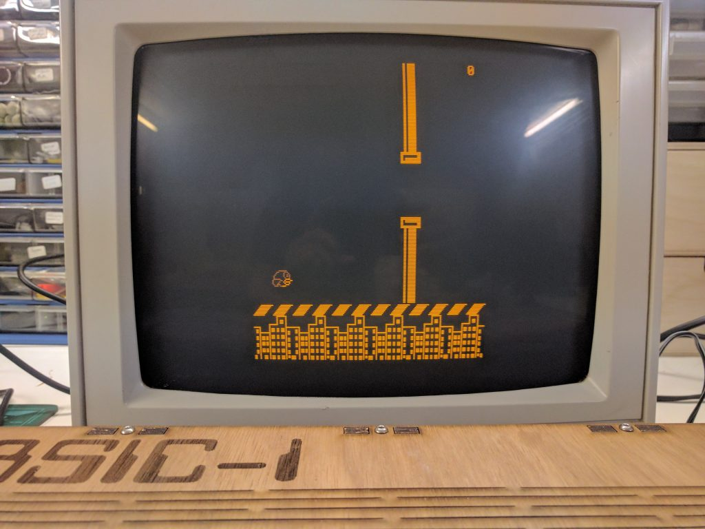

In 2014 BASIC became a 50 year old programming language, to celebrate that event I started writing my own BASIC interpreter. How hard could that be? Just a few evenings of work and I would have coded my own... Well, 3 years later I can say I have hit a certain milestone, I can now play flappy bird, written in my own version of BASIC running on my home build computer.

\[caption id="attachment\_547" align="aligncenter" width="451"\] Flappy Bird running on my BASIC-1.\[/caption\]

### The reason why

I grew up with BASIC, well actually, the computers I used in the early 80's had a BASIC interpreter built-in. The Coleco ADAM was my first computer and it came with a tape holding BASIC. A few years later I got a C64 which just booted to BASIC. So my first programming got done in BASIC, and it still holds a warm spot in my memories. That is probably one of the reasons why I did this and maybe also because I have an interest in language design?

### My own computer

A BASIC interpreter running in a console is a nice project on its own, but I wanted to create my own computer. Just like its counterparts from the early 80's it would boot into BASIC. To be honest, when I started writing the interpreter, it was ment to be a console only application running on my macbook. Therefore I really did not bother with memory efficient coding, like tokenizing the BASIC keywords for storage efficiency. This put some stress on the choice of microcontroller. The easiest solution would have been to port it to a raspberry pi, but I wanted to give a more 8 bit feel to it. That is why I settled on the XMega128A4 from Atmel, using the [BreadMate XMega PDI board from Batsocks](http://www.batsocks.co.uk/products/BreadMate/XMega%20PDI.htm).

This microcontroller has 128KB of program space (flash) and 8KB of static RAM. That should be enough for a small BASIC computer.

The next problem to tackle was the keyboard input. For this I refurbished a keyboard from a broken C64. Although the XMega has enough inputs to connect to the C64 keyboard I decided I would create a [dedicated keyboard controller from an Arduino mini](https://github.com/nanoflite/C64-serial-keyboard). This way I could free up some precious memory and IO pins from the XMega.

As an output device I experimented with a thermal printer first. Below you see the small thermal printer and the C64 keyboard connected to a breadboard prototype.

\[caption id="attachment\_548" align="aligncenter" width="600"\] First outing of the BASIC-1, still using a thermal printer for output.\[/caption\]

But that was rather cumbersome to use and did not gave me the user experience I wanted. I wanted to recreate the feeling from this youtube movie, but with just a cheap thermal printer that became a big no no.

\[embed\]https://youtu.be/uepU\_gTkMFY\[/embed\]

Luckily the makers of the BreadMate have a nice Arduino shield, the [TellyMate](http://www.batsocks.co.uk/products/Other/TellyMate.htm), that is a serial to TV out module. It can show 38x25 characters on the screen and even has some primitive graphics capabilities.

As a storage solution I used an SD card. Although I was planning on using an old cassette tape for data storage, I just made this choice out of convenience. It would be an easy way to exchange BASIC programs between my macbook and the BASIC computer.

### High level schematic of the hardware

 

\[caption id="attachment\_544" align="aligncenter" width="600"\] High-level schematic.\[/caption\]

### The enclosure

I first built the BASIC-1 on a breadboard. That proved to be rather a brittle setup, with wires coming loose when you want to move it or store it.

\[caption id="attachment\_549" align="aligncenter" width="600"\] Breadboard prototype.\[/caption\]

For the enclosure I made a model in Sketchup and laser cut it at the [FabLab013](http://fablab013.nl/) of Tilburg.

\[embed\]https://youtu.be/97jckJyywC8\[/embed\]

The design in Sketchup went fine. I made a view from the top and exported it to DXF.

\[caption id="attachment\_550" align="aligncenter" width="450"\] Top view to laser cut.\[/caption\]

Only, I was not able to make a 3d model out of it as I can't figure out how to bend the upper sheet.

\[caption id="attachment\_551" align="aligncenter" width="450"\] 3D view of the BASIC-1.\[/caption\]

### Putting it all together

To make the BASIC-1 more permanent, I used a prototype PCB and soldered everything together. Maybe I could make a PCB for this, but in the end, that would take too much time and effort.

The XMega runs at 3.3V and the Arduino Mini and TellyMate at 5V. I used [a bidirectional level shifter module from Adafruit](https://www.adafruit.com/products/395) to solve this.

I also provided a switch so I can put the XMega into programming mode to upload new firmware. That proved to be a good decision. I had to reflash it a lot of times when I was writing some BASIC programs and finding out bugs that did not manifest themselves on the OSX version.

I ran the BASIC interpreter against valgrind to check for memory issues and was surprised that there were a few memory leaks and buffer overflows. Anyhow, that explained some of the strange behavior on the XMega, which is tighter on memory.

I really wanted a way to store programs on the BASIC-1, we could do that on the XMega itself, via flashing the program to a part of the program memory. Or I could use a tape cassette (like the [datasette from Commodore](https://en.wikipedia.org/wiki/Commodore_Datasette)), but I settled on using an SD card instead. This is a nice way to exchange programs from my macbook anyhow. The downside is that the SD card library takes a lot of the precious memory away from BASIC. I'm using the [FatFS modul](http://elm-chan.org/fsw/ff/00index_e.html)e for this.

Another thing I did was to use two different UART's on the XMega for the video driver and the keyboard. The keyboard runs at 19200 baud, while I wanted to use the maximum speed of 57600 baud for the TellyMate.

Because I'm using a separate keyboard driver, there are some IO pins freed up. That allowed me to add a LED, a piezo speaker and a classic joystick. There are some nice things you can do with these. The LED is controlled by an IO pin, so by providing a BASIC statement to control the LED, I was able to write a primitive LED fade routine in BASIC.

    :::basic
    100 FOR S=1 TO 20
    110 LED(0)
    120 SLEEP(S)
    130 LED(1)
    140 SLEEP(20-S)
    150 NEXT S
    160 FOR S=1 TO 20
    170 LED(0)
    180 SLEEP(20-S)
    190 LED(1)
    200 SLEEP(S)
    210 NEXT S
    220 GOTO 100

The extra IO pins also allowed me to connect a joystick to the XMega. I used a classic digital joystick from the 80's and 90's with a SUBD9 connector.

After soldering an giving everything a place in the enclosure, I used a hot glue gun to stick everything in place.

\[caption id="attachment\_554" align="aligncenter" width="650"\] Inside the BASIC-1.\[/caption\]

### Programming the BASIC-1

When I started to write some BASIC programs on the BASIC-1, it came clear that for 'larger' projects it would be better to develop them on my macbook. The BASIC interpreter provides some simple editing capabilities. You can delete characters with the 'DEL' key. You can clear a line by just providing the line number and pressing enter. But you cannot go back to an existing line and edit it. Off course, we have the SD card reader and it would be possible to just swap the SD card every time we wanted to test the program.

However, I wanted to automate the part of uploading and executing a BASIC program to the BASIC-1. What I ended up with was to put an audio switch jack between the keyboard serial input and the Arduino Mini. By plugging in an audio jack and connecting that to a USB to UART cable, I could take over the keyboard from my macbook. By using keywords like 'NEW' and 'RUN' I could control the BASIC-1 computer. And by just outputting lines starting with a number, I could program it. Here's a photo of the switch jack setup.

\[caption id="attachment\_555" align="aligncenter" width="487"\] Programming interface via audio switch jack.\[/caption\]

Next, I wrote a [Python tool to automate talking to the BASIC-1](https://github.com/nanoflite/basic-1-loader). This tool is then used in a [Makefile](https://github.com/nanoflite/basic-1-flappy-bird/blob/master/Makefile) to automate uploading and running a BASIC program.

### Towards Flappy Bird

I got the idea of porting Flappy Bird to the BASIC-1 when I stumbled upon [an implementation of it for the ZX-Spectrum](http://retrogamingmagazine.com/2015/01/24/type-program-flappy-bird-zx-spectrum-available-old-school-method/).

One of the cool things about the TellyMate shield is that it has support for custom characters. So, it would be possible to create this game with custom graphics and just let it look 'real'.

I needed a way to define characters, and to detect which character was at a certain location of the screen (for collision detection between the bird and the pipes). Further, we need a way to plot a character on a certain position on the screen. We also want to detect a button press on the joystick to make the bird flap. And, if possible, I wanted a moving background.

Now, to be honest, the interpreter I wrote is not ment to be fast. It does not tokenize BASIC keywords, but instead relies on string matching while interpreting.  So execution is not that fast, but fast enough. The other performance killer for games is the serial interface to the video display. Maximum communication speed is 57600 baud, that translates to roughly 8 frames per second, given no overhead. In practice, that is lot slower as we need to send special escape code to plot characters at a certain position. After some testing it turned out moving the pipes and the bird were already a stretch.

As I wanted a moving background as well, I settled on an old animation trick. Instead of redrawing a portion of the screen I redefine the characters on the fly.  Redefining the diagonal stripe characters at run time gives the illusion of a scrolling line.

\[caption id="attachment\_556" align="aligncenter" width="300"\] Moving stripes\[/caption\]

Here's a list of the BASIC commands I implemented to get Flappy Bird running.

- PLOT(x,y,char): To draw a character at a certain screen position.
- AT(x,y): Position the cursor.
- BUTTON(): To read the joystick button (There is also a JOYSTICK() keyword, but that is not used in the game).
- DEFCHAR(code, definition): To define a custom character
- CURSOR(): To disable the cursor
- OVERFLOW(): To disable automatic scrolling.

Another problem is memory space. The XMega that I use has 8KB  of static RAM available. But this has to be shared by the BASIC interpreter and by the FatFS module and also by the running BASIC program. I put some effort in optimizing memory usage, but in the end I could only free up less then 4KB of space. And I had to divide this space into program memory, memory for the BASIC stack and variables. In the end I was able to give program memory 3072 bytes, the stack 256 bytes and then the rest is there for variables. That is not that much.

For it all to work, I had to split up the program in 2 parts. A loader that first loads the custom characters and the game itself. In the end, the game occupies 2532 bytes of program space.

You can have a look at [the BASIC listing for Flappy Bird on github](https://github.com/nanoflite/basic-1-flappy-bird). In the README, there is a breakdown of the routines used. For the fun of it, here's a picture of the listing (links to the source of it on github).

\[caption id="attachment\_558" align="aligncenter" width="1252"\] Basic listing for Flappy Bird.\[/caption\]

### Summary

I probably could go on writing about this little computer I build. It has enough material to provide a series of blog posts. Maybe I'll delve a bit deeper in the BASIC interpreter, why I took some design decisions for it and such. But for now this is it.

I satisfied my own need to implement a BASIC interpreter and had a great time creating and making the BASIC-1 computer. It thought me a lot about laser cutting, let me once again hold a soldering iron and a hot glue gun.

I really enjoyed trying to get Flappy Bird to run. It was nice to do some BASIC programming. It rekindled my interest in the history of personal computing as well. And I hope this article spurs some inspiration for you to take on a project.

I  have some ideas on the future of my BASIC interpreter. One of the things I'm toying with is porting it to the Raspberry Pi with a minimal frame buffer interface. I think that could create a nice little BASIC game computer... we will see.

To close, here's a video of the BASIC-1 in action.

\[embed\]https://youtu.be/gRQUKAh-ZCw\[/embed\]

### References

- [My BASIC interpreter on github](https://github.com/nanoflite/basic)
- [BASIC Flappy Bird code on github](https://github.com/nanoflite/basic-1-flappy-bird)
- [Python tool to control the BASIC-1](https://github.com/nanoflite/basic-1-loader)
- [FatFS library](http://elm-chan.org/fsw/ff/00index_e.html)
- [TellyMate serial to video shield](http://www.batsocks.co.uk/products/Other/TellyMate.htm)
- [XMega 128A4U dev board from batsocks](http://www.batsocks.co.uk/products/BreadMate/XMega%20PDI%20AV.htm)
- [FabLab013](http://fablab013.nl/)
- [Bidrectional level shifter](https://www.adafruit.com/products/395)
