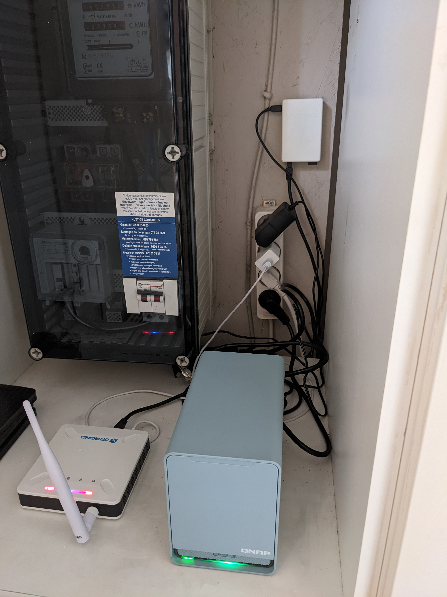

Tech minimalism... does that even exists? I don't know. What I do know is that I'm on a quest to take back control of my internet presence, and I made a huge step towards this. All my sites got moved away from hosting in the cloud or on a dedicated (rented) server to my home lab (as they say it...). Even more, my personal internet site is hosted on a Raspberry Pi 3, together with a gopher, gemini and finger version.

### How I came here

I registered my first vanity domain name in 1999, which was `vandenbrande.com`. From then on I always had some sort of website up and running.
Probably that first one must have been some static HTML, handwritten. I even tried to mix in a bit of [ASP](https://en.wikipedia.org/wiki/Active_Server_Pages) at some time, if I remember correctly.
Looking back, I don't quite understand why I would ever have been hosting my own stuff on a Windows server, must have been some kind of wrong turn I accidentally took...
Anyhow, for a long time I hosted my own site as a wiki, with the [TWiki](https://twiki.org/) engine as the platform. That choice was not a bad one. TWiki is written Perl, and I was actually making a living out of writing Perl applications at that moment in my life.
Next up I moved to dedicated blogging platforms. The first must have been [MovableType](https://movabletype.com/), but then I moved on to [Wordpress](https://wordpress.org/). I had already established my own side business and one of the things I did was to write Wordpress plugins and applications. So it was a natural choice for me to run my personal site on Wordpress as well.
But, there's one problem with these platforms... they evolve, they need to be upgraded, either to get new functionality or to close some security holes. You can't just host them and don't look back.
So, I bit the bullet and crafted (actually, threw together) my own static site generator. That was a first step...

### Hardware

Now finally, I took another step. I registered a fixed IP address for my home office and moved my personal sites to my homelab. This was not an easy step, nor was it a cheap one. But doing so, I (re)learned a ton and if I'm correct, it'll cost me less in the long run.
I even dropped my rented cloud server on Hetzner and migrated a few 'commercial' sites to be hosted on my homelab as well.

Key in this move was to acquire a machine on which I can host my sites. I already had a QNAP TS-653D running, which I use for my business to host several tools on, and as an environment to run docker and virtual machines for development and testing.
I could have settled for a DIY on a linux based intel NUC or similar setup. But I have to say that managing the QNAP system is rather straightforward and higher level than a DIY linux environment.
In the summer of 2021, QNAP launched the QMiro series of mesh router, together with a small NAS, the QMiroPlus-201W. It has the same CPU as the TS-653D and a 2-bay drive expansion. Memory was low at 4GB, but as I had upgraded my TS-653D beyond QNAP's specs to 32GB, I thought I could to the same with the QMiroPlus.
It turned out the QMiroPlus could not be upgraded to 32GB, but I added a 4GB module, giving me 8GB of RAM. That should be enough for my needs.

Next, my personal site is hosted on Raspberry PI3 using an ethernet connection.

Here's the diagram of my personal website setup:

```
{internet} ~> [router] --> [QMiroPlus] --> [Raspberry PI3]
```

### Software for the network infrastructure

I'm using nginx as a reverse proxy for all my hosted sites. While I was configuring nginx for this, I stumbled upon [Nginx Proxy Manager](https://nginxproxymanager.com/) (NPM). I host NPM as a container on the QMiroPlus and use it to
point to my site running [bozo httpd](http://www.eterna.com.au/bozohttpd/) as an inetd service on NetBSD on my Raspberry Pi. The rest of the services is hosted in a similar way.

The really nice thing about NPM is that it can terminate HTTPS traffic with [Let's Encrypt](https://letsencrypt.org/) certificates. The refresh of these certificates is baked into NPM. Man, did I loose a ton of time in the past renewing these...

Here's the overview:

```
{internet} ~~(fixed ip address)~> [router] ~~(port forwarding)~> [QMiro+ router] ~~(port forwarding)~> [nginx proxy] ~~(proxy)~> [inetd] ~> [bozo httpd]
```

The traffic comes in from the internet over my telecom router. Next the traffic is forwarded (via port forwarding) to the router part of the QMiro+. This then is forwarded (via port forwarding) to the NAS part of the QMiro+ to a container running NPM on QNAP Container station.
Next up, NPM proxies this traffic to a httpd service running under inetd on a NetBSD powered Raspberry Pi3.

I really like this setup. It gives me the power I need and very strangely, having the services running on physical hardware so close to me makes me care about them a lot more. It is not abstract anymore, I open the door to my homelab closet and I see the hardware humming and buzzing...



### List of services and software used

I run all of these services, like in the good old times, from [inetd](https://en.wikipedia.org/wiki/Inetd).

  * [Bozotic http://](https://en.wikipedia.org/wiki/Inetd)
  * [Gophernicus gopher://]()
  * [vger gemini://](https://tildegit.org/solene/vger)
  * [fingerd](https://man.netbsd.org/NetBSD-5.0.1/fingerd.8)

### Aftermath

After setting this all up, I'm thinking about hosting a few more internet facing (public) services. Maybe a small product I come up with... don't know yet.
With regard to security, I think it is all bolted tight. There's also a clear separation between my internal network (QNAP TS-653D + intel NUC) and the external one (QMiro+, raspberry pi).
To connect remotely to my home office I'm using VPN, so nothing from my internal services is exposed.
The only drawback is hardware failover. If any of the hardware components fail, then I have to buy a new one and set it up again. I do keep backups and such, but spare hardware is another thing.

Drop me a line if you want some more technical details, I hope I've inspired some to pursue the same road as me and become less depending on external providers...

Tech simplicity? Nope... fun? Yes!